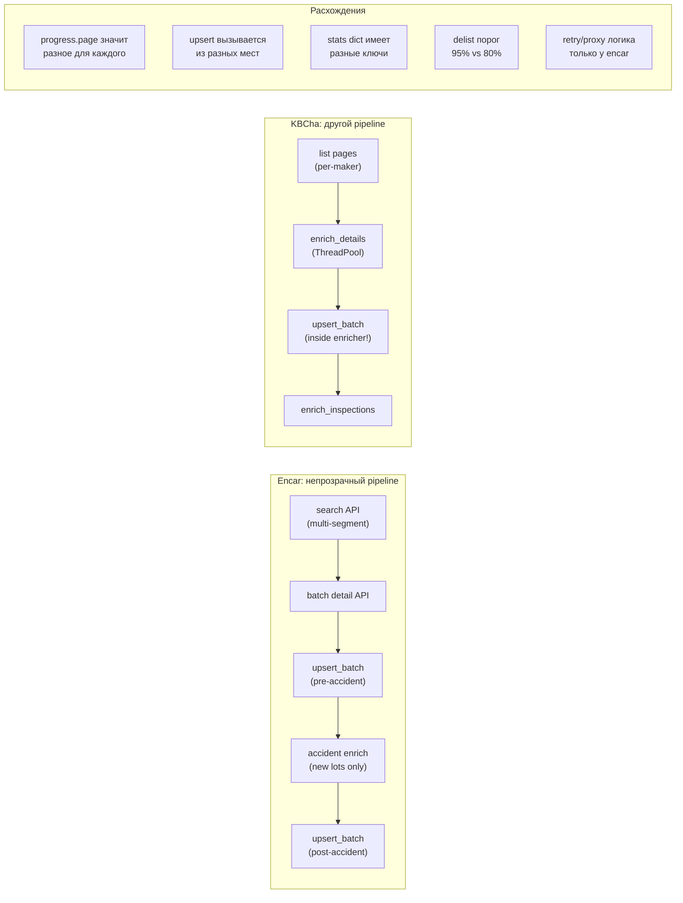
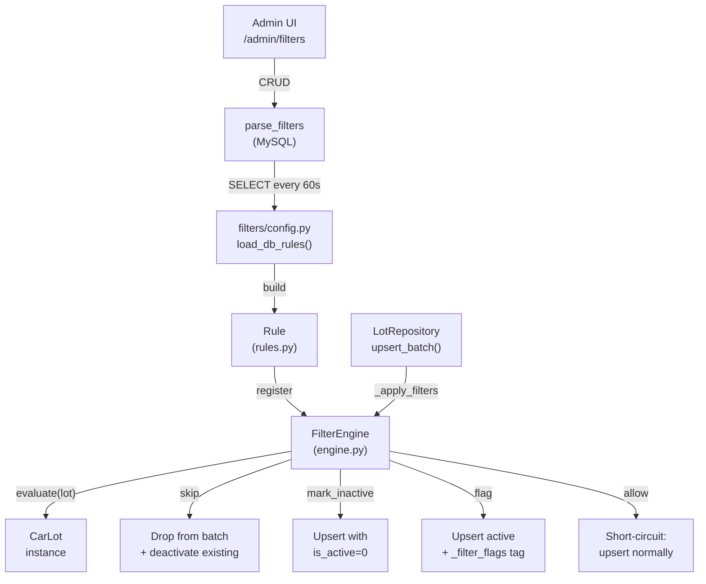
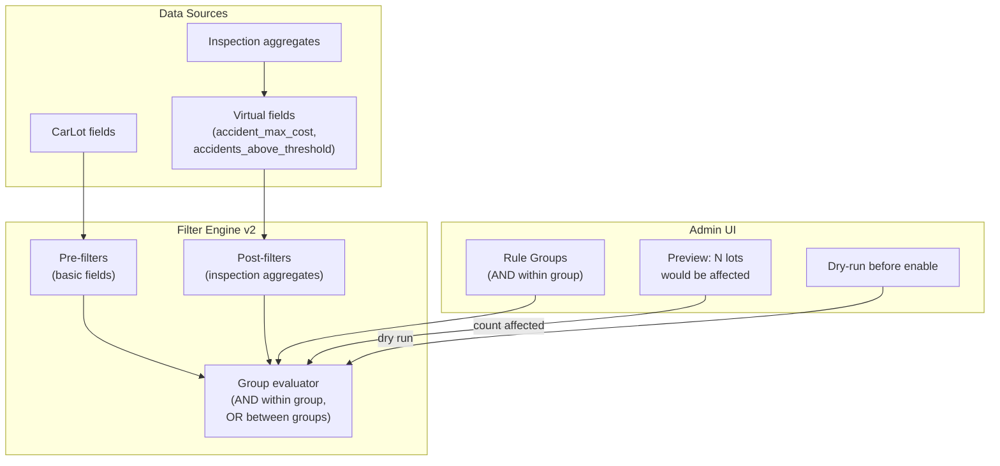
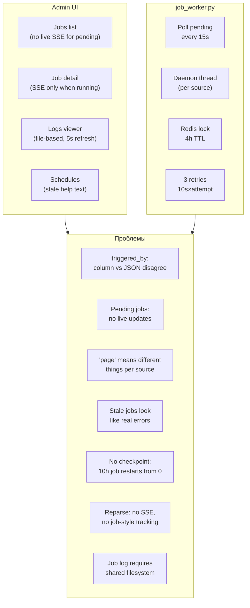
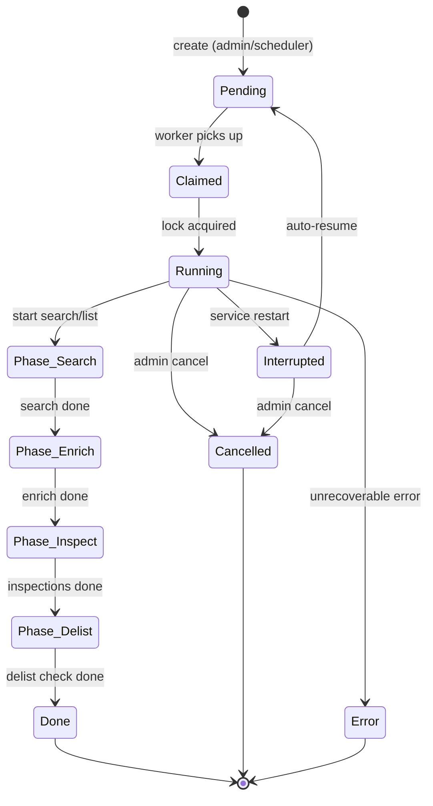

# Carbot V3: Анализ и план оптимизации

> Полный аудит парсеров, БД, фильтров и Laravel админки.
> Предыдущие планы: PLAN.md, PLAN_FILTERS.md (выполнены), PLAN_V2.md (AI-поиск, погрешности).

---

## Текущая архитектура (как есть)

```mermaid
flowchart TD
    subgraph parsers [Python Parsers]
        EncarParser["encar/__init__.py\n(1267 строк)"]
        KbchaParser["kbcha/__init__.py\n(473 строк)"]
        EncarNorm["encar/normalizer.py"]
        KbchaNorm["kbcha/normalizer.py"]
        KbchaDetail["kbcha/detail_parser.py"]
        KbchaEnrich["kbcha/enricher.py"]
    end
    subgraph shared [Shared Layer]
        BaseParser["parsers/base.py"]
        BaseNorm["_shared/normalizer_base.py"]
        Vocab["_shared/vocabulary.py"]
        FieldReg["fields/registry.py"]
    end
    subgraph db [MySQL]
        LotsTable["lots (50+ columns)"]
        Photos["lot_photos"]
        Inspections["lot_inspections"]
        Changes["lot_changes"]
    end
    subgraph laravel [Laravel Admin]
        AdminCtrl["AdminController.php"]
        LotDTO["LotDTO.php"]
        KBProvider["KBChachaProvider.php"]
    end
    EncarParser --> BaseParser
    KbchaParser --> BaseParser
    EncarNorm --> BaseNorm
    KbchaNorm --> BaseNorm
    EncarParser -->|"upsert_batch"| LotsTable
    KbchaParser -->|"upsert_batch"| LotsTable
    AdminCtrl --> LotsTable
    KBProvider --> LotDTO
```



---

## Сводка по текущему состоянию системы

| Компонент | Статус | Главная проблема |
|---|---|---|
| Encar parser | **НЕРАБОЧИЙ** | Missing abstract methods `get_source_key`/`get_source_name` |
| KBCha parser | Работает на ~12% | ConnectTimeout блокирует 87% брендов |
| KBCha inspections (kb_paper) | Почти нулевой парсинг | `parsed_count=1` для большинства |
| KBCha inspections (autocafe) | Частично работает | `cert_no="82"` баг |
| Dynamic filters | Работает, но ограничены | Нет AND-логики, нет inspection-данных |
| lots.raw_data | Раздутый | ~2-5KB дублей на строку (photos, mapped fields) |
| lot_photos | Чистая | OK, но дублируется в raw_data |
| Laravel admin | Работает | Мёртвый код, DTO не синхронизирован |

---

## ЧАСТЬ 1: Критические баги и несогласованности

### 1.1 `LotRepository._lot_to_row` не существует
В `parser/repository.py` при ошибке батча вызывается `_lot_to_row(l)`, но такого метода нет — будет `NameError`. Нужно заменить на `l.to_db_row()`.

### 1.2 `get_lots_by_source` не загружает `sell_type` / `sell_type_raw`
При реконструкции `CarLot` из строк БД пропущены `sell_type` и `sell_type_raw` — ломает `run_reenrich` и фильтры при перепарсинге.

### 1.3 KBCha `retail_value` не маппится
`parser/parsers/kbcha/detail_parser.py` парсит `_original_msrp_man`, но не присваивает `retail_value`. Документация (`fields/registry.py`) утверждает что KBCha заполняет это поле — но код этого не делает.

### 1.4 `tax_paid` зависит от несуществующего `tax_unpaid`
В `parser/parsers/kbcha/field_mapper.py` `apply_raw_data` читает `tax_unpaid`, но ни один парсер его не устанавливает.

### 1.5 Lien/seizure — разные форматы между источниками
- Encar: английские токены (`clean`, `lien`, `seizure`)
- KBCha: корейский текст из HTML-таблиц
- Фильтры и UI не могут корректно сравнивать across sources

### 1.6 `body_type` не нормализован
В данных: `sedan`, `suv` (английские), но также `스포츠카` (корейский). Нужно пропустить через `BaseNormalizer`.

### 1.7 Порог делистинга расходится
- Encar: 95% покрытия API total
- KBCha: 80% от количества в БД
- Разные denominators могут вести к ложным массовым делистингам

---

## ЧАСТЬ 2: Оптимизация таблицы `lots` (уменьшение размера)

### 2.1 Очистка `raw_data` от дублей
Поля для удаления из `raw_data` (уже есть в нормализованных колонках):
- `photos` — дублирует `lot_photos`
- `sell_type` — есть колонка `sell_type`
- `manufacturer_kr` / `model_kr` / `badge_kr` — дублируют `make` / `model` / `trim`
- `year_month` — дублирует `registration_year_month`
- `photo_count`, `photo_path` — избыточны
- `origin_price` — дублирует `retail_value`

**Экономия: ~2-5 KB на строку**. Расширить `_RAW_DATA_BLOCKLIST` в `parser/models.py`.

### 2.2 Вынос полей из `raw_data` в колонки
| Поле в `raw_data` | Новая колонка | Тип |
|---|---|---|
| `domestic` | `is_domestic` | `BOOLEAN` |
| `import_type` | `import_type` | `VARCHAR(30)` |
| `seat_count` | `seat_count` | `TINYINT UNSIGNED` |

### 2.3 Справочник опций
Сейчас `options` хранит коды `["001", "003", "051"]` без расшифровки. Создать `option_definitions` для UI.

### 2.4 Дедупликация `lot_photos`
Удалить дубли URL в `raw_data.photos` (одна `_001.jpg` повторяется 4-6 раз).

### 2.5 Аудит индексов
- Индекс на удалённую `price_krw` — проверить что дропнулся
- Добавить индексы на `import_type` / `is_domestic` при выносе

---

## ЧАСТЬ 3: Унификация интерфейса парсеров

> **Важно**: Парсеры не должны быть одним классом — encar (JSON API) и kbcha (HTML scraping) получают данные принципиально по-разному. Цель — **унифицированный интерфейс и предсказуемый lifecycle**, чтобы job_worker, admin UI и логи видели одинаковую картину независимо от источника.

### 3.1 Текущие проблемы



Конкретные расхождения:
- **`page`** в progress: Encar = derived (`total // PAGE_SIZE`), KBCha = list page number, KBCha enricher = lot index. Один номер "page" значит три разных вещи.
- **`upsert_batch`** вызывается из `kbcha/enricher.py` (внутри ThreadPool worker), а у Encar — из `__init__.py` (main loop). Непредсказуемо.
- **Stats dict**: Encar возвращает `{ new, updated, errors, ... }`, KBCha добавляет `maker_breakdown`, `api_coverage_pct`. Admin UI пытается отображать оба — но ключи не совпадают.
- **Delist**: Encar 95% от API total, KBCha 80% от DB count. Разные denominators.

### 3.2 Целевая архитектура — Unified Lifecycle Protocol

Не единый парсер, а **контракт** который оба парсера реализуют:

```python
class ParserLifecycle(Protocol):
    """Контракт для job_worker и admin UI"""

    # === Identity ===
    def get_source_key(self) -> str: ...
    def get_source_name(self) -> str: ...

    # === Phases (каждый парсер реализует по-своему) ===
    def run(self, on_progress: ProgressCallback, filters: dict) -> RunResult: ...

    # === Unified result ===
    @dataclass
    class RunResult:
        new: int
        updated: int
        stale: int           # delisted
        errors: int
        total_processed: int
        total_available: int  # API/site total
        coverage_pct: float
        elapsed_s: float
        phases: list[PhaseResult]  # <-- NEW: per-phase breakdown
        error_log: list[str]
        error_types: dict[str, int]
        extra: dict           # source-specific (maker_breakdown, etc)

    @dataclass
    class PhaseResult:
        name: str            # "search", "enrich_details", "enrich_inspections"
        lots_in: int
        lots_out: int
        elapsed_s: float
        errors: int

    # === Progress callback contract ===
    @dataclass
    class ProgressUpdate:
        phase: str           # "search" | "enrich" | "inspect" | "delist"
        phase_progress: float  # 0.0 - 1.0 within phase
        total_progress: float  # 0.0 - 1.0 overall
        lots_found: int
        lots_processed: int
        message: str         # human-readable status
```

### 3.3 Что меняется для каждого парсера

**Encar** по-прежнему делает multi-segment search + batch detail + accident enrich — но **каждый этап** репортит через `ProgressUpdate` с единым `phase` и `total_progress`.

**KBCha** по-прежнему ходит по maker pages + HTML enrichment — но `upsert_batch` выносится из `enricher.py` обратно в `__init__.py`, а enricher только возвращает обогащённые лоты.

### 3.4 Конкретные рефакторинги

- **`RunResult` dataclass** в `parsers/base.py` — оба парсера возвращают одинаковую структуру
- **`PhaseResult`** — breakdown по фазам; admin UI может показать таймлайн
- **`ProgressUpdate`** — единый формат прогресса с `phase` + `total_progress`; job_worker не интерпретирует "page" по-разному
- **`ParallelFetcher`** в `_shared/` — общий ThreadPool + retry + backoff (сейчас дублируется)
- **`NormalizationPipeline`** в `_shared/` — fuel → trans → body → drive → color → lien/seizure
- **Вынести `upsert_batch`** из `kbcha/enricher.py` обратно в `kbcha/__init__.py`
- **Единый delist порог** — настраиваемый per-source в конфиге (не хардкод 95% vs 80%)

---

## ЧАСТЬ 4: Полная матрица покрытия полей (Field Coverage Audit)

> Легенда: **A** = Always, **S** = Sometimes, **N** = Never, **B** = Bug (должно быть но не работает)

### 4.1 Основные поля лота

| # | CarLot field | Encar | KBCha | Расхождение / Действие |
|---|---|---|---|---|
| 1 | `id` | A (API Id) | A (kbcha_{carSeq}) | OK |
| 2 | `source` | A ("encar") | A ("kbcha") | OK |
| 3 | `make` | A (vocabulary) | A (vocabulary) | OK, оба нормализованы |
| 4 | `model` | A (raw Korean) | A (parse_title) | Encar НЕ нормализован |
| 5 | `year` | S (FormYear[:4]) | S (parse_year) | Оба могут дать 0 |
| 6 | `price` | A (만원→KRW) | S (만원→KRW) | KBCha может быть 0 |
| 7 | `mileage` | A (default 0) | A (list+detail) | OK |
| 8 | `registration_year_month` | S (6-digit FormYear) | S (parse_year_month) | Оба nullable |
| 9 | `sell_type` | A (search time) | **Rarely** (external insp only) | KBCha: слишком поздно, мало данных |
| 10 | `sell_type_raw` | A | Rarely | То же |

### 4.2 Технические характеристики

| # | CarLot field | Encar | KBCha | Расхождение / Действие |
|---|---|---|---|---|
| 11 | `fuel` | S (search+detail) | S (detail table) | Оба нормализованы |
| 12 | `transmission` | S (search+detail) | S (detail table) | Оба нормализованы |
| 13 | `body_type` | S (detail only) | S (detail table) | Encar: иногда Korean (`스포츠카`). Нормализовать |
| 14 | `drive_type` | S (heuristic+detail+sellingpoint) | S (title+detail) | OK |
| 15 | `engine_volume` | S (detail cc→L) | S (detail cc→L) | OK |
| 16 | `fuel_economy` | **N** | S (detail table) | Encar API не даёт |
| 17 | `cylinders` | **N** | **B** (код есть, но engine_str не передаётся) | Исправить KBCha маппинг |
| 18 | `color` | S (raw, НЕ normalized) | S (detail, normalized) | Encar: добавить norm.color |
| 19 | `seat_color` | S (search) | S (detail) | OK |

### 4.3 Юридический статус

| # | CarLot field | Encar | KBCha | Расхождение / Действие |
|---|---|---|---|---|
| 20 | `vin` | S (detail+inspection) | S (detail+inspection) | OK |
| 21 | `plate_number` | S (detail) | S (detail) | OK |
| 22 | `registration_date` | S (detail+record+insp) | **B** (glossary mapping broken) | Исправить KBCha field_mapper |
| 23 | `lien_status` | S ("clean"/"lien") | S ("clean"/"lien") | **Encar: English от record. KBCha: тоже English после normalize.** Проверить что формат одинаков |
| 24 | `seizure_status` | S ("clean"/"seizure") | S ("clean"/"seizure") | То же |
| 25 | `tax_paid` | **N** | **B** (зависит от несуществующего tax_unpaid) | Исправить или удалить |
| 26 | `title` (legal) | **Default "Clean"** | **Default "Clean"** | Никогда не заполняется реально |
| 27 | `document` | **N** | **N** | Мёртвая колонка |

### 4.4 Аварийность и история

| # | CarLot field | Encar | KBCha | Расхождение / Действие |
|---|---|---|---|---|
| 28 | `has_accident` | S (record+insp, new lots only) | S (detail+insp) | **Encar: не обновляется для existing lots** |
| 29 | `flood_history` | S (record+insp) | S (detail+insp) | OK |
| 30 | `total_loss_history` | S (record) | S (detail) | OK |
| 31 | `owners_count` | S (record) | S (detail) | OK |
| 32 | `insurance_count` | S (record) | S (detail regex) | OK |
| 33 | `damage` | **N** (goes to InspectionRecord) | S (inspection panels) | **Encar никогда не ставит lot.damage** |
| 34 | `secondary_damage` | **N** | S (outer panels) | То же |
| 35 | `repair_cost` | S (record: my+other cost) | **N** | KBCha не считает |
| 36 | `mileage_grade` | **N** | S (detail regex) | Encar не даёт |
| 37 | `new_car_price_ratio` | **N** | S (detail regex) | Encar не даёт |

### 4.5 Ценообразование и опции

| # | CarLot field | Encar | KBCha | Расхождение / Действие |
|---|---|---|---|---|
| 38 | `retail_value` | S (detail originPrice) | **B** (_original_msrp_man парсится, но retail_value не всегда ставится) | Проверить KBCha _apply_combined |
| 39 | `options` | S (detail standard) | S (detail car-option) | Encar: коды. KBCha: Korean labels |
| 40 | `paid_options` | **N** (API имеет, но не читает) | S (detail select-option) | Encar: добавить чтение |
| 41 | `warranty_text` | **N** | S (detail parse) | Encar: не даёт |

### 4.6 Дилер

| # | CarLot field | Encar | KBCha | Расхождение / Действие |
|---|---|---|---|---|
| 42 | `dealer_name` | S (contact.userId) | S (heuristic) | Encar: username, KBCha: имя дилера |
| 43 | `dealer_company` | S (partnership) | S (상사명 regex) | OK |
| 44 | `dealer_location` | **N** | S (주소 regex) | Encar не маппит |
| 45 | `dealer_phone` | S (contact.no) | S (phone regex) | OK |
| 46 | `dealer_description` | **N** | S (판매자 설명) | Encar не маппит |

### 4.7 Медиа и ссылки

| # | CarLot field | Encar | KBCha | Расхождение / Действие |
|---|---|---|---|---|
| 47 | `image_url` | S (Photos[0]) | S (first img) | OK |
| 48 | `lot_url` | A (constructed) | A (constructed) | OK |
| 49 | `photos` | S (detail all) | S (detail gallery) | OK, оба → lot_photos |
| 50 | `trim` | S (BadgeDetail) | S (parse_title) | OK |

### 4.8 Поля ТОЛЬКО в raw_data (не колонки)

| Поле | Encar | KBCha | Стоит вынести? |
|---|---|---|---|
| `seat_count` | S (detail spec) | Нет | **Да → новая колонка** |
| `domestic` / `is_domestic` | S (detail category) | Нет | **Да → новая колонка** |
| `import_type` | S (detail category) | Нет | **Да → новая колонка** |
| `manufacturer_kr` | A (search) | Нет | Нет (дубль make) |
| `model_kr` / `badge_kr` | A (search) | Нет | Нет (дубль model/trim) |
| `origin_price` | S (detail) | Нет | Нет (дубль retail_value) |
| `raw_info` | Нет | S (detail table) | Нет (справочный dump) |
| `tags` | Нет | S (list badges) | Нет (пока) |
| `engine_code` | S (inspection) | S (external insp) | Возможно |
| `recall` / `recall_types` | S (inspection) | Нет | **Да → has_recall BOOLEAN** |

### 4.9 Мёртвые колонки (НИКОГДА не заполняются ни одним парсером)

| Колонка | Действие |
|---|---|
| `has_keys` | **Удалить** (verification endpoint не вызывается) |
| `document` | **Удалить** (ни один источник) |
| `title` (legal) | **Переименовать** в `condition_title` или **удалить** (всегда "Clean") |

### 4.10 Баги маппинга (код есть, но не работает)

| Поле | Источник | Баг |
|---|---|---|
| `cylinders` | KBCha | `engine_str` не передаётся в `field_mapper.apply_raw_data` |
| `registration_date` | KBCha | glossary mapping `"연식_reg"` не совпадает с ключом таблицы `"연식"` |
| `tax_paid` | KBCha | Зависит от `tax_unpaid` которое никто не ставит |
| `retail_value` | KBCha | `_original_msrp_man` парсится, но проверить что `_apply_combined` действительно ставит `retail_value` |
| `has_accident` | Encar | Обновляется только для **new lots**, не для existing |
| `damage` | Encar | Данные идут в `InspectionRecord`, не в `CarLot.damage` |
| `color` | Encar | `norm.color` НЕ вызывается (raw Korean) |

---

## ЧАСТЬ 4B: Нормализация данных — план действий

> Отдельный модуль на основе полного аудита 50 полей CarLot (ЧАСТЬ 4).

### 4B.1 Исправить баги маппинга (7 штук)

| # | Баг | Файл | Исправление |
|---|---|---|---|
| 1 | KBCha `cylinders` — `engine_str` не передаётся в field_mapper | `kbcha/field_mapper.py`, `kbcha/enricher.py` | Передать `engine_str` из `raw_data` в `apply_raw_data` target dict |
| 2 | KBCha `registration_date` — ключ `"연식_reg"` не совпадает с `"연식"` | `kbcha/field_mapper.py` L75-87 | Исправить ключ маппинга или добавить `"연식"` → `registration_date` |
| 3 | KBCha `tax_paid` — зависит от несуществующего `tax_unpaid` | `kbcha/field_mapper.py` | Парсить `"세금미납"` в detail_parser, передать в field_mapper |
| 4 | KBCha `retail_value` — `_original_msrp_man` не всегда конвертируется | `kbcha/enricher.py` `_apply_combined` | Добавить explicit assignment `lot.retail_value = msrp * 10000` |
| 5 | Encar `has_accident` — не обновляется для existing lots | `encar/__init__.py` `_paginate_query` | Запускать `_enrich_accident_data` и для updated lots (не только new) |
| 6 | Encar `damage` — данные уходят в InspectionRecord, не в CarLot | `encar/__init__.py` | Копировать `outer_parts` summary в `lot.damage` при record/inspection enrich |
| 7 | Encar `color` — `norm.color` не вызывается | `encar/__init__.py` `_lot_from_search` | Добавить `color=norm.color(item.get("Color", ""))` |

### 4B.2 Удалить мёртвые колонки

Миграция:
```sql
ALTER TABLE lots DROP COLUMN has_keys;
ALTER TABLE lots DROP COLUMN document;
-- title: переименовать или удалить после обсуждения
```

Обновить `CarLot` dataclass в `parser/models.py` — убрать поля.
Обновить `LotDTO.php` — убрать свойства.

### 4B.3 Вынести поля из raw_data в колонки

Миграция:
```sql
ALTER TABLE lots ADD COLUMN seat_count TINYINT UNSIGNED NULL AFTER engine_volume;
ALTER TABLE lots ADD COLUMN is_domestic BOOLEAN NULL AFTER sell_type_raw;
ALTER TABLE lots ADD COLUMN import_type VARCHAR(30) NULL AFTER is_domestic;
```

Обновить парсеры:
- Encar: `lot.seat_count = detail["spec"].get("seatCount")`
- Encar: `lot.is_domestic = detail["category"].get("domestic")`
- Encar: `lot.import_type = detail["category"].get("importType")`
- KBCha: `lot.seat_count` из detail info table `"인승"` (если доступно)

Обновить `CarLot` dataclass, `_RAW_DATA_BLOCKLIST`, `LotDTO`.

### 4B.4 Расширить `_RAW_DATA_BLOCKLIST`

В `parser/models.py` `CarLot._RAW_DATA_BLOCKLIST` добавить:
```python
_RAW_DATA_BLOCKLIST = {
    "photos", "photo_path", "photo_count", "sell_type",  # уже есть
    "manufacturer_kr", "model_kr", "badge_kr",            # дубль make/model/trim
    "model_group_kr",                                      # дубль model
    "year_month",                                          # дубль registration_year_month
    "origin_price",                                        # дубль retail_value
    "domestic",                                            # вынесено в is_domestic
    "import_type",                                         # вынесено в колонку
    "seat_count",                                          # вынесено в колонку
}
```

### 4B.5 Нормализация значений между источниками

| Поле | Проблема | Решение |
|---|---|---|
| `body_type` | Encar: иногда Korean (`스포츠카`) | Добавить в `ENCAR_BODY_MAP` в `vocabulary.py` |
| `color` | Encar: raw Korean, KBCha: normalized | Вызвать `norm.color()` в Encar `_lot_from_search` |
| `lien_status` | Оба: English after normalize | Проверить что оба дают `"clean"`/`"lien"` |
| `seizure_status` | То же | Проверить что оба дают `"clean"`/`"seizure"` |
| `options` | Encar: коды (`"001"`), KBCha: Korean labels | Добавить `option_definitions` справочник для UI |
| `model` | Encar: raw Korean concat, KBCha: parsed | Long-term: единый model normalizer |

### 4B.6 Использовать неиспользуемые данные Encar API

| Данные | Текущее | Действие |
|---|---|---|
| `paid_options` (detail) | Читается только `standard` | Добавить чтение `choice`/`paid` groups |
| `dealer_location` | Не маппится (только `lot.location`) | Маппить `contact.address` → `dealer_location` |
| `detail.condition` | Загружается но не используется | Использовать для `lot.condition` если нужно |
| `InspectionRecord.outer_parts` → `lot.damage` | Не копируется | Скопировать summary при inspection enrich |

### 4B.7 Добавить `has_recall` из inspection данных

Миграция:
```sql
ALTER TABLE lot_inspections ADD COLUMN has_recall BOOLEAN DEFAULT FALSE AFTER simple_repair;
ALTER TABLE lot_inspections ADD COLUMN my_accident_cost BIGINT UNSIGNED NULL AFTER has_recall;
ALTER TABLE lot_inspections ADD COLUMN other_accident_cost BIGINT UNSIGNED NULL AFTER my_accident_cost;
```

Encar: заполнять из `raw_data.recall` при `upsert_inspection`.

### 4B.8 Порядок выполнения модуля

```
 1. Phase 0    — починить EncarParser abstract methods + KBCha normalizer NameError
 2. 4B.1       — исправить 7 багов маппинга
 3. 4B.2       — удалить мёртвые колонки (миграция)
 4. 4B.3       — новые колонки (миграция)
 5. 4B.4       — расширить blocklist (models.py)
 6. 4B.5       — нормализация (vocabulary.py, парсеры)
 7. 4B.6       — использовать неиспользуемые данные Encar
 8. 4B.7       — has_recall + cost columns (миграция)
 9. TRUNCATE   — очистить таблицы
10. DEPLOY     — запуск парсинга с нуля (оба источника)
11. 4B.9       — POST-LAUNCH АУДИТ (см. ниже)
```

### 4B.9 Post-launch аудит целостности данных

После первого полного прогона обоих парсеров — запустить аудит.

**Шаг 1: Accuracy-отчёт через существующий инструмент**
```bash
php artisan fields:compute-coverage
```
Открыть `/admin/fields` — там уже есть breakdown по каждому полю и источнику (% заполнения, количество, виртуальные поля photos/inspections). Это основной инструмент.

**Шаг 2: Проверить ожидаемые улучшения в accuracy-отчёте**

| Поле | До фиксов | Ожидание после |
|---|---|---|
| KBCha `retail_value` | 0% | >50% |
| KBCha `registration_date` | 0% | >30% |
| KBCha `cylinders` | 0% | >20% |
| Encar `damage` | 0% | >10% |
| Encar `color` normalized | Korean text | English values |
| `seat_count` (новая) | не было | >60% Encar |
| `is_domestic` (новая) | не было | >80% Encar |
| `has_keys` (удалена) | не должна быть | отсутствует |
| `document` (удалена) | не должна быть | отсутствует |

**Шаг 3: Точечные SQL-проверки нормализации (то, что accuracy-отчёт не покрывает)**
```sql
-- Korean в body_type (должно быть 0)
SELECT body_type, COUNT(*) FROM lots WHERE body_type REGEXP '[가-힣]' GROUP BY body_type;

-- Blocklisted ключи в raw_data (должно быть 0)
SELECT source, SUM(JSON_CONTAINS_PATH(raw_data, 'one', '$.photos')) as photos_leak,
  SUM(JSON_CONTAINS_PATH(raw_data, 'one', '$.manufacturer_kr')) as mfr_leak
FROM lots GROUP BY source;

-- Средний размер raw_data (ожидание: <2KB вместо 3-5KB)
SELECT source, ROUND(AVG(LENGTH(raw_data))) as avg_bytes FROM lots GROUP BY source;

-- autocafe cert_no='82' (если Phase 6 сделан)
SELECT COUNT(*) FROM lot_inspections WHERE cert_no = '82';
```

**Шаг 4: Если отклонения — итерация**

По результатам accuracy-отчёта и SQL-проверок решаем: фиксить и перепарсить отдельные поля, или двигаться к следующим фазам.

---

## ЧАСТЬ 5: Laravel Admin — улучшения

### 5.1 Мёртвый код
- `AdminController::fieldStats()` и `accuracyRefresh()` — мёртвые (роуты редиректят)
- `field-mappings.blade.php` — мёртвый view

### 5.2 LotDTO пропускает поля
Не включает: `options`, `dealer_company`, `dealer_location`, `dealer_description`, `raw_data`, `registration_date`.

### 5.3 `KBChachaProvider::normalize()` — рассинхронизирован
Не учитывает новые колонки (`sell_type`, `registration_year_month`).

### 5.4 Fields page показывает только 8 полей вместо ~50

**Проблема**: `FieldRegistryService` пытается получить полную схему тремя способами:
1. `storage/app/fields.json` (файл) — не существует
2. `python -m fields.schema` (Process) — падает (Python недоступен из Laravel контейнера или `PARSER_DIR` не настроен)
3. `fallbackSchema()` — **8 хардкоженных полей** (make, year, price, mileage, sell_type, has_accident, flood_history, insurance_count)

В итоге страница `/admin/fields` видит только fallback. Таблица `field_coverage_stats` может быть пустой (команда не запускалась), а `FieldMappingsService` тоже может падать с пустым результатом. Union из трёх пустых источников = 8 fallback-полей.

**Решение**:
1. **Deploy-время**: Добавить в `start.sh` / CI step генерацию `storage/app/fields.json` через `python -m fields.schema > storage/app/fields.json`. Это самый быстрый path — никаких Process-вызовов в runtime.
2. **Python-сторона**: `parser/fields/schema.py` должен экспортировать ВСЕ поля из `CarLot` dataclass + виртуальные (photos, inspections). Сейчас `registry.py` может не покрывать все колонки.
3. **Fallback**: Расширить `fallbackSchema()` — добавить все основные колонки `lots` таблицы (vin, model, badge, fuel, transmission, body_type, color, drive_type, displacement, cylinders, options, dealer_*, registration_date, retail_value, damage, lien_status, seizure_status и т.д.), чтобы даже при полном отказе Python страница показывала полный список.
4. **Admin UI**: Добавить warning banner если schema пришла из fallback ("Schema загружена из fallback. Запустите `php artisan fields:export-schema` для полного списка полей").

---

## ЧАСТЬ 6: Оптимизация `lot_inspections`

### 6.1 Баг: autocafe `cert_no = "82"`
Почти все autocafe-записи имеют `cert_no: "82"` — парсинг ошибочного элемента. Нужно исправить парсер.

### 6.2 `kb_paper` — нулевой парсинг
`parsed_count: 1`, `parsed_fields: ["cert_no"]` для большинства. Парсер не работает для checkpaper.iwsp.co.kr.

### 6.3 Бойлерплейт в `notes`
autocafe записи содержат одинаковый юридический текст (~600 символов) в каждой записи.

### 6.4 Encar `cert_no` — невалидные значения
`202603030` (лишний 0), `20261136738` (мусор). Нет валидации формата.

### 6.5 Вынос данных из `raw_data` inspections
Добавить колонки: `my_accident_cost BIGINT`, `other_accident_cost BIGINT`, `has_recall BOOLEAN`.

### 6.6 Comparison QA
Нормализовать case при сравнении (fuel: `Diesel` vs `diesel`). Показывать расхождения accident/mileage в admin.

---

## ЧАСТЬ 7: Критические проблемы из `parse_jobs` (URGENT)

### 7.1 EncarParser полностью нерабочий
```
TypeError: Can't instantiate abstract class EncarParser without an implementation
for abstract methods 'get_source_key', 'get_source_name'
```

### 7.2 KBCha `normalizer` NameError
`NameError: name 'normalizer' is not defined` — переменная не инициализирована.

### 7.3 KBCha ConnectTimeout — 87.6% брендов пропущено
- 현대 (53,226), 기아 (49,062), 제네시스 (8,794), 한국GM (10,334) — 0 лотов
- Логика: 1 попытка + 1 retry → пропуск бренда целиком
- Нужен exponential backoff + proxy rotation + deferred retry queue

### 7.4 Серия крашей (8 подряд)
Нет checkpoint/resume — каждый рестарт начинает с нуля при 10-часовых прогонах.

### 7.5 Производительность
21,883 лота за 9ч 56мин = 1.64 сек/лот. При полном покрытии (176K) = 80+ часов.

---

## ЧАСТЬ 8: Анализ и улучшение системы динамических фильтров

### 8.0 Текущая архитектура



**Операторы**: eq, ne, gt, gte, lt, lte, in, not_in, between, is_null, is_not_null, contains, not_contains, regex

**Действия**: allow (short-circuit) > skip (drop+deactivate) > mark_inactive (is_active=0) > flag (tag only)

### 8.1 Что работает хорошо
- 14 операторов покрывают основные сценарии
- 4 действия с приоритетами
- Dot-path navigation для `raw_data` вложенных полей
- Автообновление каждые 60с без рестарта
- Scoping по source (encar/kbcha/global)

### 8.2 Критические ограничения

**Проблема 1: Нет AND-логики между полями**

Пример "insurance_count > 3 AND accident_cost > 10000" — невозможен. Правила работают как OR.

```
Текущая логика:
Rule A: insurance_count > 3  → skip   ← skip даже если cost < 10000
Rule B: repair_cost > 10000  → skip   ← skip даже если insurance < 3

Нужная логика:
Group 1 (AND):
  Rule A + Rule B → skip ТОЛЬКО если ОБА true
```

**Решение**: Добавить `rule_group_id` в `parse_filters`. Правила с одинаковым group_id = AND. Без группы = OR (как раньше).

**Проблема 2: Фильтры не видят inspection-данные**

Данные из `InspectionRecord` (accidents[], costs) не доступны для фильтрации.

**Решение**: Виртуальные агрегатные поля на `CarLot` (accident_max_cost, accidents_above_threshold).

**Проблема 3: Timing — фильтры ДО enrichment**

Encar: `upsert_batch` → ФИЛЬТРЫ (accident fields = NULL!) → `_enrich_accident_data` → второй `upsert_batch`.

**Решение**: Pre-filters (basic) + Post-filters (accident/inspection).

### 8.3 Баги
1. `_deactivate_existing` audit mismatch — `lot_ids[:affected]` не гарантирует правильные ID
2. `not_in` + None → False (должно быть True)
3. `is_allowed` возвращает True для `flag` — путаница с `allow`
4. UI не показывает `between`/`not_in` когда поле не выбрано

### 8.4 Целевая архитектура фильтров



### 8.5 Лог пропущенных лотов (skip audit trail)

**Проблема**: Когда фильтр пропускает лот с `ACTION_SKIP`, информация теряется безвозвратно:
- Для **новых** лотов (ещё нет в БД) — нет никакой записи. Лот просто не попадает в `lots`.
- Для **существующих** лотов — пишется `lot_changes` с `deactivated_filter`, но без деталей (какое правило сработало).
- `FilterEngine.log_summary()` даёт только агрегатные числа в лог-файле.
- В Admin UI нет раздела для просмотра пропущенных лотов.

**Решение**:

**A. Таблица `filter_skip_log`** (новая):
```sql
CREATE TABLE filter_skip_log (
    id BIGINT AUTO_INCREMENT PRIMARY KEY,
    source VARCHAR(20) NOT NULL,          -- encar / kbcha
    source_id VARCHAR(100) NOT NULL,      -- внешний ID лота
    lot_url VARCHAR(500),                 -- прямая ссылка на лот
    rule_name VARCHAR(100) NOT NULL,      -- имя правила
    rule_id INT UNSIGNED,                 -- FK на parse_filters.id
    action ENUM('skip','mark_inactive'),
    field_name VARCHAR(100),              -- какое поле совпало
    field_value TEXT,                     -- значение поля при совпадении
    skipped_at TIMESTAMP DEFAULT CURRENT_TIMESTAMP,
    INDEX idx_source_date (source, skipped_at),
    INDEX idx_rule (rule_id)
);
```

**B. Изменения в `FilterEngine`**:
- `evaluate()` при `ACTION_SKIP` / `ACTION_MARK_INACTIVE` записывает в batch-буфер
- Новый метод `flush_skip_log(repo)` — bulk INSERT в `filter_skip_log`
- URL формируется из `source` + `source_id` (Encar: `https://fem.encar.com/cars/detail/{id}`, KBCha: `https://www.kbchachacha.com/public/car/detail.kbc?carSeq={id}`)

**C. Admin UI — новый раздел `/admin/filter-log`**:
- Таблица: дата, source, source_id (ссылка), правило, значение поля, действие
- Фильтры: по source, по rule, по дате
- Пагинация (filter_skip_log может расти быстро)
- Кнопка "Очистить старше N дней" (ротация)
- Retention: auto-cleanup записей старше 30 дней (cron / scheduled command)

**D. Обогащение `lot_changes`**:
- Для существующих лотов которые деактивируются фильтром — писать `rule_name` и `field_value` в `lot_changes.metadata` JSON.

### 8.6 Примеры новых фильтров

| Сценарий | Сейчас | После |
|---|---|---|
| insurance > 3 AND cost > 10000 | Невозможно | AND-группа |
| >3 аварий каждая >5M вон | Невозможно | Virtual field |
| Дешёвые + старые | OR (2 правила) | AND-группа: price < 3M AND year < 2010 |
| KBCha без inspection | is_null | Virtual: inspection_count eq 0 |
| Preview перед включением | Нет | Dry-run endpoint |

---

## ЧАСТЬ 9: Job System — предсказуемость и прозрачность

### 9.0 Текущие проблемы



### 9.1 `triggered_by` — два источника правды

**Проблема**: Таблица `parse_jobs` имеет колонку `triggered_by` (default `'admin'`). Но scheduler записывает `triggered_by` **внутри JSON** `filters`, а колонку оставляет default. Admin UI читает из `filters.triggered_by` для бейджа — но SQL-запросы по колонке дадут неправильный результат.

**Решение**: Scheduler должен записывать `triggered_by` в **колонку**, а не в JSON. Убрать дублирование.

### 9.2 Pending jobs — нет live updates

**Проблема**: В `jobs.blade.php` SSE подключается только к строкам с `data-status="running"`. Pending jobs **не получают live update** — пользователь не видит когда job стартовал, пока не обновит страницу.

**Решение**: Подключать SSE ко всем non-terminal jobs (pending + running). Worker уже публикует status change в Redis.

### 9.3 Progress — "page" значит разное

**Проблема**: `progress.page` в Encar = `total // PAGE_SIZE` (derived), в KBCha = номер страницы списка, в KBCha enricher = индекс лота. Admin UI показывает все как "стр. N" — но это три разных вещи.

**Решение**: Перейти на `ProgressUpdate` с `phase` + `total_progress` (0.0-1.0). UI показывает процентный прогресс-бар и текущую фазу, а не абстрактную "страницу".

### 9.4 Stale jobs — неотличимы от реальных ошибок

**Проблема**: При рестарте сервиса все `running` jobs ставятся в `error` с `"service restarted"`. В UI они выглядят как реальные failure. В дампе — 8 подряд таких "ошибок".

**Решение**: Ввести отдельный статус `interrupted` (или отдельное поле `interrupted_at`). UI показывает их жёлтым (warning), не красным (error).

### 9.5 Нет checkpoint/resume

**Проблема**: KBCha job длится 10+ часов. При рестарте всё начинается с нуля. Из-за этого 8 рестартов = 8 потерянных прогонов.

**Решение**: Добавить checkpoint механизм:
- При каждом page callback сохранять `checkpoint` в `parse_jobs.progress` (последний обработанный maker + page)
- При рестарте `interrupted` job может быть **resumed** вместо рестарта
- Admin UI: кнопка "Resume" рядом с "Retry"

### 9.6 Schedules UI — вводящий в заблуждение текст

**Проблема**: `schedules.blade.php` говорит "изменения вступят в силу после рестарта парсера". Но `scheduler.py` **перечитывает** `parser_schedules` из БД каждые 60 секунд и hot-reload'ит.

**Решение**: Обновить текст на "Изменения применяются автоматически в течение 1 минуты".

### 9.7 Reparse — непрозрачен

**Проблема**: `reparse_worker.py` работает через отдельную таблицу `reparse_requests`, без Redis SSE, без per-job логов. В admin UI показывается только статус запроса, но нет прогресса или логов.

**Решение**: Унифицировать с job system — reparse создаёт `parse_job` с `type=reparse` и проходит через тот же pipeline.

### 9.8 Job logs — требуют shared filesystem

**Проблема**: Per-job log пишется в `logs/jobs/job-{id}.log` на стороне parser container. Laravel читает тот же path. Если filesystem не шарится — admin видит пустые логи.

**Решение** (варианты):
- **A**: Shared volume (текущий подход, но нужен docs)
- **B**: Parser пишет лог в `parse_jobs.log_content` (MEDIUMTEXT) — self-contained, но может раздуть БД
- **C**: Parser пишет лог в Redis stream → Laravel читает из Redis — real-time + no shared FS

**Рекомендация**: Вариант A (shared volume) + fallback к DB для последних N строк.

### 9.9 Целевой Job Lifecycle



**Ключевые изменения:**
- **`Interrupted`** статус вместо `error` для рестартов
- **Фазы** видны в UI (search → enrich → inspect → delist) с прогрессом каждой
- **Resume** — interrupted jobs могут продолжить с checkpoint
- **SSE для pending** — live updates с момента создания

### 9.10 Admin UI — target improvements

| Текущее | Целевое |
|---|---|
| Список jobs без live update для pending | SSE для всех non-terminal jobs |
| "стр. 415" (непонятно) | "Enrich: 67% (14,200 / 21,200)" |
| Красные "ошибки" при рестарте | Жёлтые "interrupted" с кнопкой Resume |
| Нет фаз | Timeline: Search (done) → Enrich (running) → Inspect (pending) |
| triggered_by из JSON | triggered_by из колонки, бейдж scheduler/admin/resume |
| Schedules "после рестарта" | "Автоматически в течение 1 мин" |
| Reparse без прогресса | Reparse через job pipeline |

---

## Порядок выполнения

```mermaid
gantt
    title Implementation Phases
    dateFormat X
    axisFormat %s
    section Phase0_URGENT
    7.1_fix_encar_abstract      :0, 1
    7.2_fix_kbcha_normalizer    :0, 1
    7.3_retry_backoff_proxy     :1, 2
    7.4_checkpoint_resume       :2, 3
    section Phase1_Bugfixes
    1.1_lot_to_row_fix          :1, 2
    1.2_sell_type_hydration     :1, 2
    1.3_kbcha_retail_value      :1, 2
    1.4_tax_paid_fix            :1, 2
    1.5_lien_normalize          :2, 3
    1.6_body_type_normalize     :2, 3
    1.7_delist_threshold        :2, 3
    section Phase2_DB_Optimize
    2.1_raw_data_cleanup        :3, 5
    2.2_new_columns_migration   :3, 4
    2.3_option_definitions      :4, 5
    2.4_photo_dedup             :4, 5
    section Phase3_Unify_Parsers
    3.2_pipeline_base           :5, 7
    3.3_shared_enricher         :6, 8
    3.3_normalize_pipeline      :6, 8
    section Phase4B_Normalize
    4B.1_fix_7_mapping_bugs     :1, 3
    4B.2_drop_dead_columns      :3, 4
    4B.3_new_columns_migration  :3, 4
    4B.4_extend_blocklist       :3, 4
    4B.5_normalize_values       :4, 5
    4B.6_encar_unused_data      :5, 6
    4B.7_has_recall_columns     :4, 5
    section Phase5_Laravel
    5.1_dead_code_cleanup       :9, 10
    5.2_dto_sync                :9, 10
    section Phase6_Inspections
    6.1_autocafe_certno         :10, 11
    6.2_kbpaper_audit           :10, 11
    6.6_comparison_qa           :11, 12
    section Phase5_Fields
    5.4_fields_page_full_schema :3, 4
    section Phase8_Filters
    8.5_skip_audit_log          :3, 5
    8.6_fix_filter_bugs         :3, 4
    8.1_rule_groups_AND         :4, 6
    8.2_virtual_inspection_fields:6, 8
    8.3_two_phase_filtering     :8, 9
    8.4_preview_dryrun_UI       :9, 10
    section Phase9_Jobs
    9.1_triggered_by_fix        :1, 2
    9.2_pending_SSE             :2, 3
    9.3_unified_progress        :5, 7
    9.4_interrupted_status      :2, 3
    9.5_checkpoint_resume       :7, 9
    9.6_schedules_text          :1, 2
    9.7_reparse_unify           :9, 11
    9.10_admin_UI_phases        :7, 9
```



---

## Оценка рисков

- **Phase 0** (URGENT) — критический, без этого парсеры не работают; низкий риск реализации
- **Phase 1** (багфиксы) — низкий риск, точечные изменения
- **Phase 2** (оптимизация БД) — средний риск, нужна миграция данных; рекомендую бэкап
- **Phase 3** (унификация интерфейса) — средний-высокий риск, но НЕ переписываем парсеры целиком — только вводим контракт `RunResult`/`ProgressUpdate` и выравниваем вызовы
- **Phase 4-5** — низкий риск, расширение существующего
- **Phase 6** (inspections) — средний риск; требует проверки живых URL
- **Phase 8** (фильтры) — средний риск; rule groups требуют изменения движка + миграции
- **Phase 9** (jobs) — средний риск; checkpoint/resume и фазы требуют координации parser+admin; quick wins (triggered_by, SSE, text) — низкий риск
