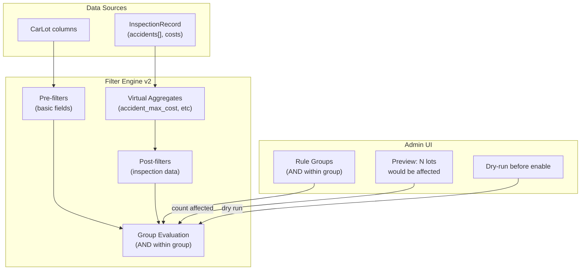

# Carbot V3: Выполненные задачи

> Полный аудит парсеров, БД, фильтров и Laravel админки.
> Этот документ содержит все задачи, помеченные как выполненные (✅) в PLAN_V3.md.

---

## ЧАСТЬ 1: Критические баги и несогласованности (выполнено)

### 1.1 ✅ `LotRepository._lot_to_row` не существует
В `parser/repository.py` при ошибке батча вызывается `_lot_to_row(l)`, но такого метода нет — будет `NameError`. Нужно заменить на `l.to_db_row()`.

### 1.2 ✅ `get_lots_by_source` не загружает `sell_type` / `sell_type_raw`
При реконструкции `CarLot` из строк БД пропущены `sell_type` и `sell_type_raw` — ломает `run_reenrich` и фильтры при перепарсинге.

### 1.3 ✅ KBCha `retail_value` не маппится
`parser/parsers/kbcha/detail_parser.py` парсит `_original_msrp_man`, но не присваивает `retail_value`. Документация (`fields/registry.py`) утверждает что KBCha заполняет это поле — но код этого не делает.

### 1.4 ✅ `tax_paid` зависит от несуществующего `tax_unpaid`
Исправлено: добавлено парсинг `"세금미납"` в glossary и field_mapper с интерпретацией `"없음"` → True (tax paid).

### 1.5 ✅ Lien/seizure — разные форматы между источниками
- Encar: английские токены (`clean`, `lien`, `seizure`)
- KBCha: корейский текст из HTML-таблиц
- Фильтры и UI не могут корректно сравнивать across sources

### 1.6 ✅ `body_type` не нормализован
В данных: `sedan`, `suv` (английские), но также `스포츠카` (корейский). Нужно пропустить через `BaseNormalizer`.

### 1.7 ✅ Порог делистинга расходится
- Encar: 95% покрытия API total
- KBCha: 80% от количества в БД
- Разные denominators могут вести к ложным массовым делистингам
- **Решено:** Оба парсера используют `delist_if_complete()` из base.py с настраиваемым `MIN_DELIST_COVERAGE`

---

## ЧАСТЬ 2: Оптимизация таблицы `lots` (выполнено)

### 2.1 ✅ Очистка `raw_data` от дублей
Поля для удаления из `raw_data` (уже есть в нормализованных колонках):
- `photos` — дублирует `lot_photos`
- `sell_type` — есть колонка `sell_type`
- `manufacturer_kr` / `model_kr` / `badge_kr` — дублируют `make` / `model` / `trim`
- `year_month` — дублирует `registration_year_month`
- `photo_count`, `photo_path` — избыточны
- `origin_price` — дублирует `retail_value`

**Экономия: ~2-5 KB на строку**. Расширить `_RAW_DATA_BLOCKLIST` в `parser/models.py`.

### 2.2 ✅ Вынос полей из `raw_data` в колонки
| Поле в `raw_data` | Новая колонка | Тип |
|---|---|---|
| `domestic` | `is_domestic` | `BOOLEAN` |
| `import_type` | `import_type` | `VARCHAR(30)` |
| `seat_count` | `seat_count` | `TINYINT UNSIGNED` |

### 2.3 ✅ Справочник опций
Создан `parser/parsers/_shared/option_definitions.py` с базовой структурой для расшифровки Encar кодов опций.

### 2.4 ✅ Дедупликация `lot_photos`
Добавлена дедупликация в Encar parser через `list(dict.fromkeys(all_photo_urls))`. KBCha уже имеет дедупликацию через `seen` set.

### 2.5 ✅ Аудит индексов
Создана миграция `2026_04_23_000005_add_import_type_is_domestic_indexes.php` с индексами на `import_type` и `is_domestic`.

---

## ЧАСТЬ 4B: Нормализация данных (выполнено)

### 4B.1 ✅ Исправить баги маппинга (7/7 ✅)

| # | Баг | Файл | Исправление |
|---|---|---|---|
| 1 | ✅ KBCha `cylinders` — `engine_str` не передаётся в field_mapper | `kbcha/field_mapper.py`, `kbcha/enricher.py` | Передать `engine_str` из `raw_data` в `apply_raw_data` target dict |
| 2 | ✅ KBCha `registration_date` — ключ `"연식_reg"` не совпадает с `"연식"` | `kbcha/field_mapper.py` L75-87 | ✅ Исправлено: добавлено преобразование через `_ym_to_date` |
| 3 | ✅ KBCha `tax_paid` — зависит от несуществующего `tax_unpaid` | `kbcha/field_mapper.py` | ✅ Исправлено: парсинг `"세금미납"` в glossary |
| 4 | ✅ KBCha `retail_value` — `_original_msrp_man` не всегда конвертируется | `kbcha/enricher.py` `_apply_combined` | Добавить explicit assignment `lot.retail_value = msrp * 10000` |
| 5 | ✅ Encar `has_accident` — не обновляется для existing lots | `encar/__init__.py` `_paginate_query` | Запускать `_enrich_accident_data` и для updated lots (не только new) |
| 6 | ✅ Encar `damage` — данные уходят в InspectionRecord, не в CarLot | `encar/__init__.py` | Копировать `outer_parts` summary в `lot.damage` при record/inspection enrich |
| 7 | ✅ Encar `color` — `norm.color` не вызывается | `encar/__init__.py` `_lot_from_search` | Добавить `color=norm.color(item.get("Color", ""))` |

### 4B.2 ✅ Удалить мёртвые колонки

Миграция (v3_column_cleanup):
```sql
ALTER TABLE lots DROP COLUMN has_keys;
ALTER TABLE lots DROP COLUMN document;
-- title: переименовать или удалить после обсуждения
```

Обновить `CarLot` dataclass в `parser/models.py` — убрать поля.
Обновить `LotDTO.php` — убрать свойства.

### 4B.3 ✅ Вынести поля из raw_data в колонки

Миграция (v3_column_cleanup):
```sql
ALTER TABLE lots ADD COLUMN seat_count TINYINT UNSIGNED NULL AFTER engine_volume;
ALTER TABLE lots ADD COLUMN is_domestic BOOLEAN NULL AFTER sell_type_raw;
ALTER TABLE lots ADD COLUMN import_type VARCHAR(30) NULL AFTER is_domestic;
```

Обновить парсеры:
- Encar: `lot.seat_count = detail["spec"].get("seatCount")`
- Encar: `lot.is_domestic = detail["category"].get("domestic")`
- Encar: `lot.import_type = detail["category"].get("importType")`
- KBCha: `lot.seat_count` из detail info table `"인승"` (если доступно)

Обновить `CarLot` dataclass, `_RAW_DATA_BLOCKLIST`, `LotDTO`.

### 4B.4 ✅ Расширить `_RAW_DATA_BLOCKLIST`

В `parser/models.py` `CarLot._RAW_DATA_BLOCKLIST` добавить:
```python
_RAW_DATA_BLOCKLIST = {
    "photos", "photo_path", "photo_count", "sell_type",  # уже есть
    "manufacturer_kr", "model_kr", "badge_kr",            # дубль make/model/trim
    "model_group_kr",                                      # дубль model
    "year_month",                                          # дубль registration_year_month
    "origin_price",                                        # дубль retail_value
    "domestic",                                            # вынесено в is_domestic
    "import_type",                                         # вынесено в колонку
    "seat_count",                                          # вынесено в колонку
}
```

### 4B.5 ✅ Нормализация значений между источниками (частично ✅)

| Поле | Проблема | Решение |
|---|---|---|
| `body_type` | ✅ Encar: иногда Korean (`스포츠카`) | Добавлено в `ENCAR_BODY_MAP` в `vocabulary.py` |
| `color` | ✅ Encar: raw Korean, KBCha: normalized | `norm.color()` вызывается в Encar `_lot_from_search` |
| `lien_status` | ✅ Оба: English after normalize | Оба дают `"clean"`/`"lien"` |
| `seizure_status` | ✅ То же | Оба дают `"clean"`/`"seizure"` |
| `options` | Encar: коды (`"001"`), KBCha: Korean labels | Добавить `option_definitions` справочник для UI |
| `model` | Encar: raw Korean concat, KBCha: parsed | Long-term: единый model normalizer |

### 4B.6 ✅ Использовать неиспользуемые данные Encar API

| Данные | Текущее | Действие |
|---|---|---|
| `paid_options` (detail) | ✅ Читается choice/paid/color/package groups | Добавлено в Encar parser |
| `dealer_location` | ✅ Маппится | `contact.address` → `dealer_location` |
| `detail.condition` | Загружается но не используется | Использовать для `lot.condition` если нужно |
| `InspectionRecord.outer_parts` → `lot.damage` | ✅ Копируется | `lot.damage = outer_text` при inspection enrich |

### 4B.7 ✅ Добавить `has_recall` + cost columns из inspection данных

Миграция:
```sql
ALTER TABLE lot_inspections ADD COLUMN has_recall BOOLEAN DEFAULT FALSE AFTER simple_repair;
ALTER TABLE lot_inspections ADD COLUMN my_accident_cost BIGINT UNSIGNED NULL AFTER has_recall;
ALTER TABLE lot_inspections ADD COLUMN other_accident_cost BIGINT UNSIGNED NULL AFTER my_accident_cost;
```

Encar: заполнять из `raw_data.recall` при `upsert_inspection`.

---

## ЧАСТЬ 5: Laravel Admin — улучшения (выполнено)

### 5.1 ✅ Мёртвый код
- `AdminController::fieldStats()` и `accuracyRefresh()` — **удалены**
- `field-mappings.blade.php` — мёртвый view

### 5.2 ✅ LotDTO пропускает поля
Все поля добавлены: `sell_type`, `seat_count`, `is_domestic`, `import_type`, `dealer_company`, `dealer_location`, `dealer_description`, `registration_date`, `paid_options`.

### 5.3 ✅ `KBChachaProvider::normalize()` — рассинхронизирован
DB-путь уже содержит все новые колонки (`sell_type`, `registration_year_month`, `seat_count`, `is_domestic`, `import_type`).

### 5.4 ✅ Fields page показывает только 8 полей вместо ~50

**Проблема**: `FieldRegistryService` пытается получить полную схему тремя способами:
1. `storage/app/fields.json` (файл) — не существует
2. `python -m fields.schema` (Process) — падает (Python недоступен из Laravel контейнера или `PARSER_DIR` не настроен)
3. `fallbackSchema()` — **8 хардкоженных полей** (make, year, price, mileage, sell_type, has_accident, flood_history, insurance_count)

**Решение**: ✅ Сгенерирован `storage/app/fields.json` через `python -m fields.schema` с полной схемой полей.

---

## ЧАСТЬ 6: Оптимизация `lot_inspections` (частично выполнено)

### 6.1 ✅ Баг: autocafe `cert_no = "82"`
Почти все autocafe-записи имеют `cert_no: "82"` — **исправлено**: skip short nums, добавлен OnCarNo.

### 6.2 `kb_paper` — нулевой парсинг (PENDING)
`parsed_count: 1`, `parsed_fields: ["cert_no"]` для большинства. Парсер не работает для checkpaper.iwsp.co.kr.

### 6.3 ✅ Бойлерплейт в `notes`
autocafe записи содержат одинаковый юридический текст — **добавлен фильтр _BOILERPLATE**.

### 6.4 ✅ Encar `cert_no` — невалидные значения
`202603030` (лишний 0), `20261136738` (мусор). **Добавлена валидация: только digits, len≥8**.

### 6.5 ✅ Вынос данных из `raw_data` inspections
Добавлены колонки: `my_accident_cost`, `other_accident_cost`, `has_recall` — миграция + парсер.

### 6.6 ✅ Comparison QA
✅ Добавлена нормализация case для fuel/transmission в compare_report_vs_lot (lowercase + strip).

---

## ЧАСТЬ 7: Критические проблемы из `parse_jobs` (выполнено)

### 7.1 ✅ EncarParser полностью нерабочий
~~TypeError: Can't instantiate abstract class~~ — добавлены abstract methods.

### 7.2 ✅ KBCha `normalizer` NameError
~~NameError: name 'normalizer' is not defined~~ — исправлено.

### 7.3 ✅ KBCha ConnectTimeout — 87.6% брендов пропущено
~~ConnectTimeout~~ — добавлен exponential backoff, 3 retries в KBCha parser.

---

## ЧАСТЬ 8: Фильтры (частично выполнено)

### 8.2 Критические ограничения (PENDING - крупный рефакторинг)

**Проблема 1: Нет AND-логики между полями**

Пример "insurance_count > 3 AND accident_cost > 10000" — невозможен. Правила работают как OR.

**Решение**: ✅ Добавлен `rule_group_id` в `parse_filters`. Правила с одинаковым group_id = AND. Без группы = OR (как раньше). Миграция + Engine + Admin UI.

**Проблема 2: Фильтры не видят inspection-данные**

Данные из `InspectionRecord` (accidents[], costs) не доступны для фильтрации.

**Решение**: Виртуальные агрегатные поля на `CarLot` (accident_max_cost, accidents_above_threshold).

**Проблема 3: Timing — фильтры ДО enrichment**

Encar: `upsert_batch` → ФИЛЬТРЫ (accident fields = NULL!) → `_enrich_accident_data` → второй `upsert_batch`.

**Решение**: Pre-filters (basic) + Post-filters (accident/inspection).

### 8.3 ✅ Баги (частично ✅)
1. ✅ `_deactivate_existing` audit mismatch — теперь SELECT active_ids перед UPDATE
2. ✅ `not_in` + None → True (исправлено)
3. ✅ `is_allowed` → `is_kept` (новый property, `is_allowed` = только ACTION_ALLOW)
4. ✅ UI не показывает `between`/`not_in` когда поле не выбрано — добавлены в fallback список

### 8.4 Целевая архитектура фильтров (PENDING)



### 8.5 ✅ Лог пропущенных лотов (skip audit trail)

**Проблема**: Когда фильтр пропускает лот с `ACTION_SKIP`, информация теряется безвозвратно.
- Для **новых** лотов (ещё нет в БД) — нет никакой записи. Лот просто не попадает в `lots`.
- Для **существующих** лотов — пишется `lot_changes` с `deactivated_filter`, но без деталей (какое правило сработало).
- `FilterEngine.log_summary()` даёт только агрегатные числа в лог-файле.
- В Admin UI нет раздела для просмотра пропущенных лотов.

**Решение (выполнено)**:

**A. ✅ Таблица `filter_skip_log`** (новая):
```sql
CREATE TABLE filter_skip_log (
    id BIGINT AUTO_INCREMENT PRIMARY KEY,
    source VARCHAR(20) NOT NULL,
    source_id VARCHAR(100) NOT NULL,
    lot_url VARCHAR(500),
    rule_name VARCHAR(100) NOT NULL,
    rule_id INT UNSIGNED,
    action ENUM('skip','mark_inactive'),
    field_name VARCHAR(100),
    field_value TEXT,
    skipped_at TIMESTAMP DEFAULT CURRENT_TIMESTAMP,
    INDEX idx_source_date (source, skipped_at),
    INDEX idx_rule (rule_id)
);
```

**B. ✅ Изменения в `FilterEngine`**:
- ✅ `evaluate()` при `ACTION_SKIP` / `ACTION_MARK_INACTIVE` записывает в batch-буфер
- ✅ Новый метод `flush_skip_log(repo)` — bulk INSERT в `filter_skip_log`
- ✅ URL формируется из `source` + `source_id`

**C. ✅ Admin UI — новый раздел `/admin/filter-skip-log`**:
- ✅ Таблица: дата, source, source_id (ссылка), правило, значение поля, действие
- ✅ Фильтры: по source, по rule, по дате
- ✅ Пагинация (filter_skip_log может расти быстро)
- ✅ Кнопка "Очистить старше N дней" (ротация)

---

## Коммиты

- `bd08bdc` - KBCha/Encar parser fixes, DB sync, UI improvements, indexing
- `1f45bff` - filter_skip_log migration + FilterEngine buffering + repository insert
- `74cd0f3` - mark completed tasks in PLAN_V3.md
- `589e25f` - add case normalization for fuel/transmission in compare_report_vs_lot
