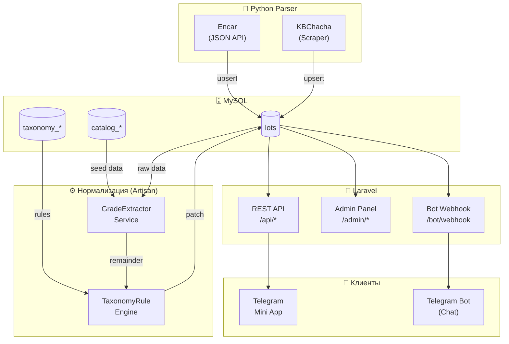
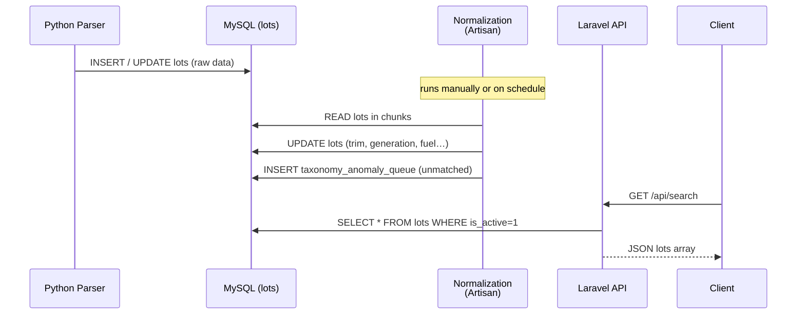

# 01 · Обзор системы

> [Index](./index.md) · **Overview** · [Structure →](./02-structure.md)

---

## Архитектура

---

## Компоненты

| Компонент | Технология | Роль |
|-----------|-----------|------|
| **Python Parser** | Python 3.11, httpx, APScheduler | Получает лоты с аукционов, пишет в `lots` |
| **MySQL** | MySQL 8 | Хранилище всех данных |
| **GradeExtractorService** | Laravel/PHP | Извлекает структурированные поля из сырого текста грейда |
| **TaxonomyRuleEngine** | Laravel/PHP | Применяет правила корректировки к лотам |
| **Laravel API** | Laravel 11, PHP 8.2 | REST API для Mini App и Bot |
| **Admin Panel** | Laravel Blade + Tailwind | Управление правилами, фильтрами, лотами |
| **Telegram Mini App** | Vanilla JS | Поиск по каталогу с фильтрами |
| **Telegram Bot** | Laravel + Groq AI | Поиск по свободному тексту |

---

## Поток данных

---

## Ключевые принципы

| Принцип | Реализация |
|---------|-----------|
| **Non-destructive** | Нормализация заполняет только NULL-поля; никогда не перезаписывает |
| **Аудит** | `raw_data['pre_norm']` хранит исходное состояние до первой нормализации |
| **Фазовые фильтры** | PRE (до записи в БД) и POST (после инспекции) — разные уровни фильтрации |
| **Rule engine** | Taxonomy-правила могут переопределять каталог (более высокий приоритет) |
| **Кэш метаданных** | Python-схема полей экспортируется в JSON-файл, не вызывается subprocess в web-запросах |

---

[Index](./index.md) · [Structure →](./02-structure.md)
