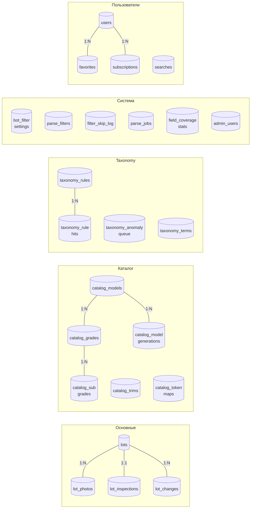

# 03 · База данных

> [← Structure](./02-structure.md) · [Index](./index.md) · [Parser →](./04-parser.md)

---

## Группы таблиц

---

## Таблица `lots` — ключевые колонки

| Колонка | Тип | Описание |
|---------|-----|----------|
| `id` | VARCHAR(100) PK | ID лота (из источника) |
| `source` | VARCHAR(20) | `encar` \| `kbcha` |
| `make` | VARCHAR(60) | Марка (корейская, напр. `현대`) |
| `model` | VARCHAR(60) | Модель (корейская, напр. `투싼`) |
| `model_en` | VARCHAR(60) | Модель (английская, напр. `Tucson`) |
| `year` | SMALLINT | Год выпуска |
| `price` | INT | Цена в KRW |
| `mileage` | INT | Пробег в км |
| — | — | **Поля нормализации** |
| `trim` | VARCHAR(40) | Комплектация (напр. `프레스티지`) |
| `generation` | VARCHAR(50) | Код поколения (напр. `TL`, `NX4`, `G30`) |
| `variant` | VARCHAR(100) | Подвариант |
| `package` | VARCHAR(100) | Пакет опций |
| — | — | **Технические характеристики** |
| `fuel` | VARCHAR(20) | `gasoline` \| `diesel` \| `hybrid` \| `electric` \| `lpg` |
| `drive_type` | VARCHAR(10) | `fwd` \| `rwd` \| `awd` \| `4wd` |
| `body_type` | VARCHAR(30) | `sedan` \| `suv` \| `hatchback` \| … |
| `engine_volume` | FLOAT | Объём двигателя (литры) |
| `cylinders` | TINYINT | Количество цилиндров |
| `seat_count` | TINYINT | Количество мест |
| `transmission` | VARCHAR(20) | Тип КПП |
| `color` | VARCHAR(30) | Цвет кузова |
| — | — | **История и состояние** |
| `has_accident` | BOOLEAN | Наличие ДТП |
| `flood_history` | BOOLEAN | История затопления |
| `total_loss_history` | BOOLEAN | Признание тотальным убытком |
| `owners_count` | SMALLINT | Количество владельцев |
| `insurance_count` | SMALLINT | Количество страховых случаев |
| — | — | **Юридический статус** |
| `lien_status` | VARCHAR(20) | Залог/обременение |
| `seizure_status` | VARCHAR(20) | Статус ареста |
| — | — | **Служебные** |
| `raw_data` | JSON | Сырые данные API + `pre_norm` snapshot |
| `is_active` | BOOLEAN | `0` = отфильтрован `parse_filters` |
| `parsed_at` | TIMESTAMP | Время парсинга |
| `expires_at` | TIMESTAMP | Время истечения актуальности |

---

## Каталог (`catalog_*`)

| Таблица | Назначение | Ключевые поля |
|---------|-----------|---------------|
| `catalog_models` | Пары марка + модель | `make_kr`, `make_en`, `model_kr` |
| `catalog_grades` | Строки грейдов со спецификациями | `model_id`, `grade_kr`, `fuel_type`, `drive_type`, `engine_volume`, `body_hint` |
| `catalog_model_generations` | Коды шасси/поколений | `model_id`, `code` (напр. `G30`, `DN8`, `5세대`) |
| `catalog_sub_grades` | Тонкие подгрейды | `grade_id`, `sub_grade_kr`, `type` (`trim\|generation\|unknown`) |
| `catalog_trims` | Строки трима с приоритетом | `make_en`, `trim_kr`, `trim_en`, `priority` |
| `catalog_token_maps` | Маппинг токенов → значения | `token`, `token_type`, `mapped_value` (NULL = шум) |

**Типы токенов** в `catalog_token_maps`:

| token_type | Примеры | Эффект |
|-----------|---------|--------|
| `fuel` | `디젤→diesel`, `가솔린→gasoline` | Канонизирует тип топлива |
| `drive` | `2wd→fwd`, `4wd→awd` | Канонизирует привод |
| `body` | `세단→sedan`, `suv→suv` | Канонизирует тип кузова |
| `gen_non_chassis` | `ev`, `hev`, `g70`, `ev6` | Исключает из детекции поколения |
| `cylinder_config` | `v6`, `i4`, `h4` | Извлекает конфигурацию цилиндров |
| `grade_spec_code` | `a180`, `e200`, `amg` | Коды спецификаций MB/BMW/Audi |
| `grade_engine_vol` | `2.0t`, `3.0l` | Объём двигателя из токена |
| `engine_family` | `gdi`, `crdi`, `tdi` | Семейство двигателя (шум) |
| `grade_seat` | `7인승` | Количество мест |

---

## Taxonomy (`taxonomy_*`)

| Таблица | Назначение |
|---------|-----------|
| `taxonomy_rules` | Правила матчинга и корректировки полей |
| `taxonomy_rule_hits` | Аудит: какое правило и какой лот затронуло |
| `taxonomy_anomaly_queue` | Нераспознанные хвосты грейдов, ожидающие классификации |
| `taxonomy_terms` | Иерархическое дерево терминов (марка → модель → поколение → трим) |

---

## Системные таблицы

| Таблица | Назначение |
|---------|-----------|
| `bot_filter_settings` | Настройки полей бот-поиска (tolerance, отображение в карточке) |
| `parse_filters` | Правила PRE/POST фильтрации лотов |
| `filter_skip_log` | Лог отфильтрованных лотов |
| `parse_jobs` | История запусков парсера и статистика |
| `field_coverage_stats` | Процент заполненности каждого поля |
| `admin_users` | Пользователи админ-панели |
| `admin_page_permissions` | Права доступа к страницам |

---

[← Structure](./02-structure.md) · [Index](./index.md) · [Parser →](./04-parser.md)
