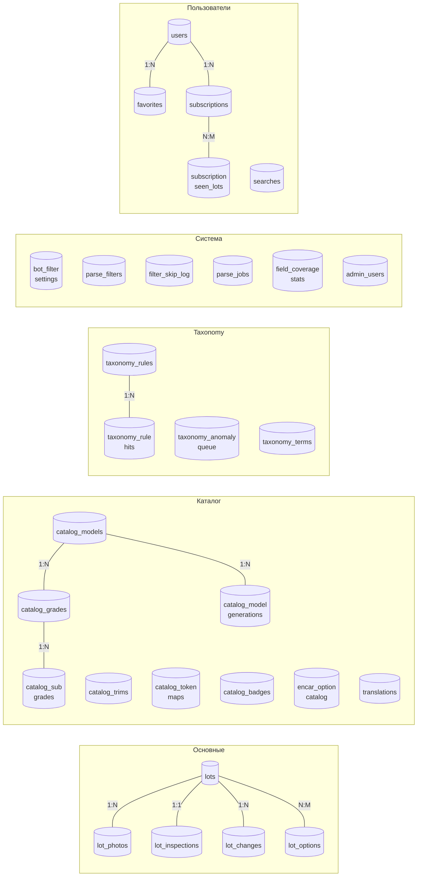

# 03 · База данных

> [← Structure](./02-structure.md) · [Index](./index.md) · [Parser →](./04-parser.md)

---

## Группы таблиц



---

## Таблица `lots` — иерархия Encar iNav

Encar организует данные в 6 уровней (iNav). Каждый уровень хранится отдельными колонками:

| Уровень | Колонка KR | Колонка EN | Пример EN |
|---------|-----------|-----------|-----------|
| 1 · Марка | `make` | `make_en` | `Hyundai` |
| 2 · ModelGroup | `model_group` | `model_group_en` | `Sonata` |
| 3 · Model (вариант) | `model` | `model_en` | `Sonata (DN8)` |
| 4 · BadgeGroup | `badge_group` | `badge_group_en` | `Gasoline 2000cc` |
| 5 · Badge | `badge` | `badge_en` | `2.0 Turbo` |
| 6 · BadgeDetail | `trim` | `trim_en` | `Prestige` |

> `model_group_en` — бывший `model_en`.  
> `model_en` (Level 3) — конкретный вариант модели с кодом шасси; заполняется `translate:run`.

---

## Таблица `lots` — все колонки

| Колонка | Тип | Описание |
|---------|-----|----------|
| `id` | VARCHAR(100) PK | ID лота из источника |
| `source` | VARCHAR(20) | `encar` \| `kbcha` |
| `make` | VARCHAR(60) | Марка (корейская) |
| `make_en` | VARCHAR(60) | Марка (английская, канонич.) |
| `model` | VARCHAR(60) | Модель Level-3 (корейская) |
| `model_group` | VARCHAR(100) | ModelGroup Level-2 (корейская) |
| `model_group_en` | VARCHAR(100) | ModelGroup Level-2 (английская) |
| `model_en` | VARCHAR(100) | Model Level-3 (английская), `translate:run` |
| `badge` | VARCHAR(150) | Badge Level-5 (корейская) |
| `badge_en` | VARCHAR(200) | Badge Level-5 (английская) |
| `badge_group` | VARCHAR(150) | BadgeGroup Level-4 (корейская) |
| `badge_group_en` | VARCHAR(150) | BadgeGroup Level-4 (английская) |
| `trim` | VARCHAR(40) | BadgeDetail Level-6 (корейская комплектация) |
| `trim_en` | VARCHAR(100) | BadgeDetail Level-6 (английская комплектация) |
| `year` | SMALLINT | Год выпуска |
| `price` | INT | Цена в KRW |
| `mileage` | INT | Пробег в км |
| `fuel` | VARCHAR(20) | `gasoline` \| `diesel` \| `hybrid` \| `electric` \| `lpg` |
| `drive_type` | VARCHAR(10) | `fwd` \| `rwd` \| `awd` \| `4wd` |
| `body_type` | VARCHAR(30) | `sedan` \| `suv` \| `hatchback` \| `wagon` \| `coupe` \| `van` |
| `engine_volume` | FLOAT | Объём двигателя (литры) |
| `seat_count` | TINYINT | Количество мест |
| `transmission` | VARCHAR(20) | Тип КПП (`automatic` \| `manual` \| `cvt` \| `dct`) |
| `color` | VARCHAR(30) | Цвет кузова (английский) |
| `seat_color` | VARCHAR(30) | Цвет салона (английский) |
| `has_accident` | BOOLEAN | Наличие ДТП |
| `flood_history` | BOOLEAN | История затопления |
| `total_loss_history` | BOOLEAN | Признание тотальным убытком |
| `owners_count` | SMALLINT | Количество владельцев |
| `insurance_count` | SMALLINT | Количество страховых случаев |
| `repair_cost` | INT | Стоимость ремонта по страховым (KRW) |
| `retail_value` | INT | Цена нового ТС (KRW) |
| `lien_status` | VARCHAR(20) | Залог/обременение (`clean` \| `lien`) |
| `seizure_status` | VARCHAR(20) | Статус ареста (`clean` \| `seizure`) |
| `sell_type` | VARCHAR(30) | `dealer` \| `private` \| `auction` \| `rental` \| `lease` |
| `vin` | VARCHAR(20) | VIN |
| `plate_number` | VARCHAR(20) | Номерной знак |
| `first_reg_date` | DATE | Дата первой регистрации |
| `listed_at` | TIMESTAMP | Дата публикации объявления |
| `lot_url` | VARCHAR(500) | Ссылка на объявление |
| `image_url` | VARCHAR(500) | Первое фото |
| `location` | VARCHAR(100) | Регион/город |
| `options` | JSON | Коды опций Encar (`["001","014",…]`) |
| `paid_options` | JSON | Платные опции |
| `raw_data` | JSON | Сырые данные API + `pre_norm` snapshot |
| `is_active` | BOOLEAN | `0` = отфильтрован `parse_filters` |
| `parsed_at` | TIMESTAMP | Время парсинга |
| `expires_at` | TIMESTAMP | Время истечения актуальности |

---

## Каталог (`catalog_*`)

### `catalog_models`

Эталонное дерево Encar iNav: make → model_group → model.

```
id | make_kr | make_en | model_group_kr | model_group_en | model_kr           | generation
---+---------+---------+----------------+----------------+--------------------+-----------
 1 | 현대     | Hyundai | 쏘나타          | Sonata         | 쏘나타(DN8)19-23   | DN8
 2 | 현대     | Hyundai | 쏘나타          | Sonata         | 쏘나타(LF)14-19    | LF
```

### `catalog_badges`

Badge KR → технические характеристики. Fallback когда detail API не вернул данные.

```
badge_kr         | fuel     | engine_volume | drive_type | is_turbo
-----------------+----------+---------------+------------+---------
2.0 터보 4WD     | gasoline | 2.0           | awd        | true
디젤 2.2 4WD     | diesel   | 2.2           | awd        | false
```

Заполняется: `catalog:build-badges ../analysis/encar_inav_tree.json --apply`

### `catalog_grades`

```
id | model_id | grade_kr              | fuel_type | drive_type | engine_volume | body_hint | seat_count
---+----------+-----------------------+-----------+------------+---------------+-----------+----------
 5 |        1 | 투싼 2.0 가솔린 2WD  | gasoline  | fwd        | 2.0           | suv       | 5
```

### `catalog_model_generations`

Список известных chassis-кодов для модели.

```
id | model_id | code
---+----------+-----
12 |        1 | DN8
13 |        1 | LF
```

### `catalog_trims`

```
id | make_en | trim_kr    | trim_en  | priority
---+---------+------------+----------+---------
 1 | Hyundai | 프레스티지  | Prestige |      10
 2 | *       | 모던        | Modern   |      20
```

### `catalog_token_maps`

```
token  | token_type      | mapped_value
-------+-----------------+-------------
디젤   | fuel            | diesel
2wd    | drive           | fwd
세단   | body            | sedan
ev     | gen_non_chassis | NULL
v6     | cylinder_config | NULL
```

---

## `translations`

KR→EN кэш переводов. Используется `translate:run` для заполнения `*_en` колонок в `lots`.

| Колонка | Описание |
|---------|----------|
| `category` | `make` \| `model` \| `model_group` \| `badge_group` \| `trim` \| `color` \| `seat_color` |
| `kr` | Исходное корейское значение |
| `en` | Английский перевод |
| `source` | `ai` \| `manual` \| `catalog` |

---

## `encar_option_catalog`

Справочник опций Encar: код → названия на KR/EN/RU.

| Колонка | Описание |
|---------|----------|
| `code` | PRIMARY KEY (`"001"`, `"014"`) |
| `name_kr` | Корейское название (`선루프`) |
| `name_en` | Английское (`Sunroof`) |
| `name_ru` | Русское (`Люк`) |
| `icon_url` | URL иконки Encar |
| `category` | `exterior` \| `safety` \| `convenience` \| `interior` |

Заполняется: `options:import-encar` (коды) + `options:name-by-ai` (переводы).

---

## Taxonomy (`taxonomy_*`)

| Таблица | Назначение |
|---------|-----------|
| `taxonomy_rules` | Правила матчинга и корректировки полей |
| `taxonomy_rule_hits` | Аудит: какое правило и какой лот затронуло |
| `taxonomy_anomaly_queue` | Нераспознанные хвосты грейдов, ожидающие классификации |
| `taxonomy_terms` | Иерархическое дерево терминов |

---

## Системные таблицы

| Таблица | Назначение |
|---------|-----------|
| `bot_filter_settings` | Настройки полей бот-поиска (tolerance, отображение в карточке) |
| `parse_filters` | Правила PRE/POST фильтрации лотов |
| `filter_skip_log` | Лог отфильтрованных лотов |
| `parse_jobs` | История запусков парсера и статистика |
| `field_coverage_stats` | Процент заполненности каждого поля |
| `admin_users` | Пользователи админ-панели |
| `subscription_seen_lots` | Просмотренные лоты по подпискам |

---

[← Structure](./02-structure.md) · [Index](./index.md) · [Parser →](./04-parser.md)
