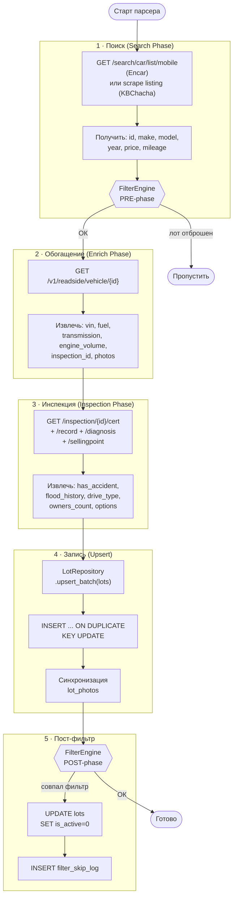

# 04 · Парсер (Python)

> [← Database](./03-database.md) · [Index](./index.md) · [Catalog →](./05-catalog.md)

---

## Запуск

```bash
python parser/main.py                             # планировщик (непрерывно)
python parser/main.py --once                      # разовый прогон всех источников
python parser/main.py --once --maker 현대 --pages 5
python parser/main.py --once --limit 100
python parser/main.py --reenrich                  # повторно обогатить уже имеющиеся лоты
python parser/main.py --debug                     # подробный лог
```

---

## Фазы парсинга



---

## `CarLot` — датакласс

Каноническое in-memory представление лота. Поля 1:1 соответствуют колонкам таблицы `lots`.

```python
@dataclass
class CarLot:
    # Идентификация
    id:          str
    source:      str          # 'encar' | 'kbcha'
    make:        str          # марка (корейская)
    model:       str          # модель (корейская)
    year:        int
    price:       int          # KRW

    # Пробег
    mileage:     int = 0

    # Технические характеристики
    fuel:         str | None = None   # 'gasoline' | 'diesel' | 'hybrid' | ...
    transmission: str | None = None
    body_type:    str | None = None
    drive_type:   str | None = None
    engine_volume: float | None = None
    cylinders:    int | None = None
    seat_count:   int | None = None
    color:        str | None = None

    # Таксономия (заполняется нормализацией Laravel)
    trim:        str | None = None
    generation:  str | None = None
    variant:     str | None = None
    package:     str | None = None

    # Документы
    vin:              str | None = None
    plate_number:     str | None = None
    first_reg_date:   str | None = None
    listed_at:        str | None = None

    # История
    has_accident:        bool | None = None
    flood_history:       bool | None = None
    total_loss_history:  bool | None = None
    owners_count:        int  | None = None
    insurance_count:     int  | None = None

    # Стоимость
    retail_value:  int | None = None
    repair_cost:   int | None = None

    # Ссылки
    lot_url:   str = ""
    image_url: str | None = None
    location:  str | None = None

    # Продажа
    sell_type:     str | None = None
    sell_type_raw: str | None = None

    # Фото → lot_photos (НЕ попадают в raw_data)
    photos: list[str] | None = None

    # Сырые API-данные (всё остальное)
    raw_data: dict = field(default_factory=dict)
```

> **_RAW_DATA_BLOCKLIST** — поля, которые **не** сериализуются в `raw_data`:
> `photos`, `photo_count`, `sell_type`, `manufacturer_kr`, `model_en`, `model_group_kr`, `year_month`, `origin_price`, `seat_count`

---

## `LotRepository` — интерфейс к БД

| Метод | Описание |
|-------|----------|
| `upsert_batch(lots)` | INSERT + ON DUPLICATE KEY UPDATE; синхронизирует `lot_photos` |
| `_apply_filters(lots, stats)` | PRE-фаза FilterEngine — удаляет лоты из памяти до записи |
| `apply_post_filters(lot_ids)` | POST-фаза FilterEngine — ставит `is_active=0` в БД |
| `_get_filter_engine()` | Ленивая загрузка + кэш правил (обновляется каждые 60 с) |
| `_deactivate_existing(lot_ids)` | Ставит `is_active=0` для исчезнувших лотов |

---

## Планировщик

APScheduler запускает каждый парсер по настроенному интервалу (обычно 1–2 ч).

- Запуски **не перекрываются**: если предыдущий ещё работает, следующий тик пропускается
- Статистика каждого запуска пишется в `parse_jobs`: `total`, `new`, `updated`, `filtered`, `errors`

---

## Источники

| Ключ | Платформа | Метод | Особенности |
|------|----------|-------|-------------|
| `encar` | [Encar](https://www.encar.com) | JSON API (`api.encar.com`) | Инспекция доступна только для сертифицированных авто |
| `kbcha` | [KBChacha](https://www.kbcha.com) | Scraper (httpx + XHR intercept) | Нужен User-Agent rotation; прокси для продакшена |

---

[← Database](./03-database.md) · [Index](./index.md) · [Catalog →](./05-catalog.md)
