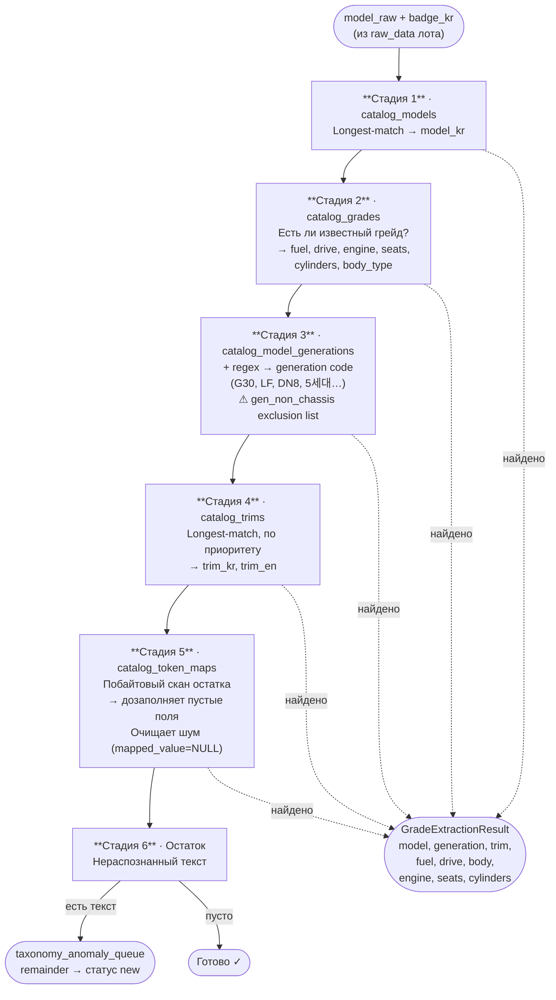

# 05 · Каталог

> [← Parser](./04-parser.md) · [Index](./index.md) · [Normalization →](./06-normalization.md)

---

## Что такое каталог

Каталог — **seed-база знаний** для извлечения таксономии. В нём хранятся известные модели, грейды, тримы и маппинги токенов, импортированные из данных Encar.

`GradeExtractorService` использует каталог для **позитивного матчинга**: вместо regex-правил он ищет известные строки и токены, и всё нераспознанное уходит в `taxonomy_anomaly_queue`.

---

## 6 стадий извлечения



> **Принцип non-destructive:** каждая стадия заполняет только ещё NULL поля.  
> Уже установленные значения не перезаписываются.

---

## `GradeExtractionResult` — результат

```php
class GradeExtractionResult
{
    public ?string $model;           // canonical model_kr из catalog_models
    public ?string $generation;      // код шасси (G60, LF, DN8…)
    public ?string $trim;            // trim_kr (напр. '프레스티지')
    public ?string $trimEn;          // trim_en для отображения ('Prestige')
    public ?string $fuel;            // gasoline|diesel|hybrid|electric|lpg
    public ?string $driveType;       // fwd|rwd|awd|4wd
    public ?string $bodyType;        // sedan|suv|hatchback|…
    public ?float  $engineVolume;    // литры
    public ?int    $cylinders;
    public ?int    $seatCount;
    public string  $remainder;       // нераспознанный текст → anomaly queue
}
```

---

## Таблицы каталога

### `catalog_models`
```
id | make_kr   | make_en  | model_kr
---+-----------+----------+---------
 1 | 현대      | Hyundai  | 투싼
 2 | 기아      | Kia      | 스포티지
```

### `catalog_grades`
```
id | model_id | grade_kr              | fuel_type | drive_type | engine_volume | body_hint
---+----------+-----------------------+-----------+------------+---------------+----------
 5 |        1 | 투싼 2.0 가솔린 2WD  | gasoline  | fwd        | 2.0           | suv
```

### `catalog_model_generations`
```
id | model_id | code
---+----------+-----
12 |        1 | TL         ← шасси 1-го поколения Tucson
13 |        1 | NX4        ← 4-е поколение
```

### `catalog_trims`
```
id | make_en | trim_kr    | trim_en     | priority
---+---------+------------+-------------+---------
 1 | Hyundai | 프레스티지  | Prestige    |      10
 2 | *       | 모던        | Modern      |      20
```

### `catalog_token_maps`
```
token    | token_type      | mapped_value
---------+-----------------+-------------
디젤     | fuel            | diesel
2wd      | drive           | fwd
세단     | body            | sedan
ev       | gen_non_chassis | NULL          ← шум, удаляется
v6       | cylinder_config | NULL          ← убирается из remainder
2.0t     | grade_engine_vol| NULL          ← обрабатывается отдельно
```

---

## Импорт каталога

```bash
# Первичный импорт из JSON-дампа Encar
php artisan catalog:import --file=../analysis/encar_taxonomy_raw.json --fresh --apply

# Посмотреть что будет (dry-run)
php artisan catalog:import --file=../analysis/encar_taxonomy_raw.json --fresh
```

`catalog_token_maps` и `catalog_trims` наполняются через сидеры в коде.

---

## `CatalogLookupService` vs `GradeExtractorService`

| | `CatalogLookupService` | `GradeExtractorService` |
|--|----------------------|------------------------|
| Подход | Lookup по model_kr → grade_kr | 6-стадийное позитивное извлечение |
| Точность | Выше для точных совпадений | Выше для зашумлённых строк |
| Аномалии | Не генерирует | Генерирует (remainder → queue) |
| Использование | Команды, дополнительный путь | **Основной путь нормализации** |

---

[← Parser](./04-parser.md) · [Index](./index.md) · [Normalization →](./06-normalization.md)
