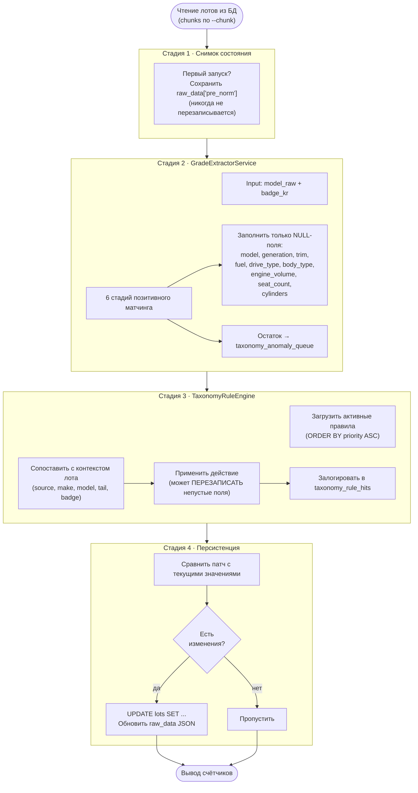

# 06 · Нормализация

> [← Catalog](./05-catalog.md) · [Index](./index.md) · [Taxonomy →](./07-taxonomy.md)

---

## Команда `lots:normalize-encar-taxonomy`

```bash
php artisan lots:normalize-encar-taxonomy [OPTIONS]

  --apply             Сохранить изменения (дефолт: dry-run)
  --limit=N           Максимум лотов (0 = все)
  --chunk=2000        Размер батча для запросов к БД
  --source=encar      Фильтр по источнику
  --random            Случайный порядок обработки
  --only-empty        Только лоты с NULL в поле trim
  --dump-trims=PATH   Записать частоту предложенных тримов в файл
```

### Типичный workflow

```bash
# 1. Посмотреть что изменится (dry-run)
php artisan lots:normalize-encar-taxonomy --source=encar --limit=5000

# 2. Применить
php artisan lots:normalize-encar-taxonomy --source=encar --limit=5000 --apply

# 3. Только пустые тримы
php artisan lots:normalize-encar-taxonomy --only-empty --apply

# 4. Проанализировать нераспознанные тримы
php artisan lots:normalize-encar-taxonomy --dump-trims=/tmp/trims.txt
```

---

## Стадии нормализации



---

## Счётчики вывода

```
Processed:      всего лотов обработано
Would update:   лотов с изменениями (dry-run режим)
Updated:        лотов фактически обновлено (--apply)
Anomalies:      новых строк в taxonomy_anomaly_queue

Per-field updates:
  model, generation, trim, fuel, drive_type, body_type,
  engine_volume, seat_count, cylinders, variant, package
```

---

## Пример изменений (до / после)

**До нормализации** (raw_data из парсера):
```
model_raw = "5시리즈 (G30) 520d xDrive M 스포츠"
badge_kr  = "스포츠라인"
trim      = NULL
generation = NULL
fuel      = NULL
drive_type = NULL
```

**После нормализации**:
```
model      = "5시리즈"
generation = "G30"
trim       = "M 스포츠"
fuel       = "diesel"          ← из "520d"
drive_type = "awd"             ← из "xDrive"
```

**Нераспознанный остаток** → `taxonomy_anomaly_queue`:
```
unknown_tail   = "스포츠라인"
make           = "BMW"
seen_count     = 147
status         = "new"
```

---

## Защита данных

| Механизм | Описание |
|----------|----------|
| **pre_norm snapshot** | До первого изменения сохраняет оригинальные значения в `raw_data['pre_norm']`. Никогда не перезаписывается. |
| **Non-destructive** | Стадия 2 (GradeExtractor) заполняет только NULL-поля |
| **Rule override** | Стадия 3 (RuleEngine) может перезаписать — это сделано намеренно для корректировок |
| **Dry-run дефолт** | Без `--apply` команда только показывает что изменится |

---

[← Catalog](./05-catalog.md) · [Index](./index.md) · [Taxonomy →](./07-taxonomy.md)
