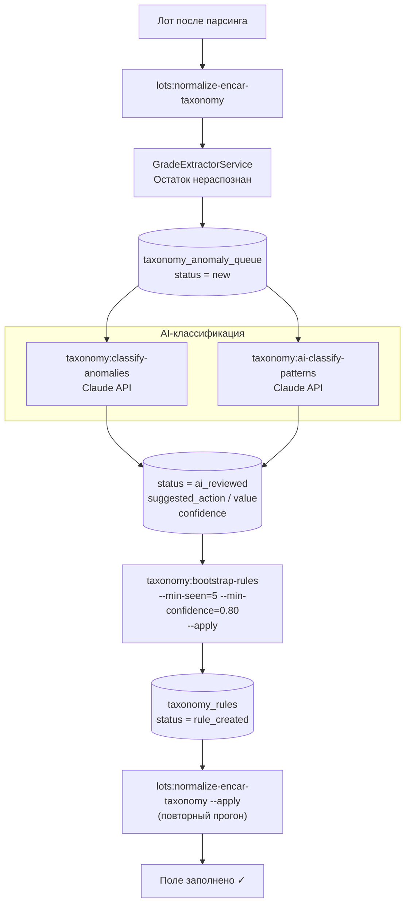

# 07 · Taxonomy Rule Engine

> [← Normalization](./06-normalization.md) · [Index](./index.md) · [API →](./08-api.md)

---

## Обзор

Taxonomy Rule Engine — слой **ручных и AI-сгенерированных корректировок** поверх каталога.  
Правила хранятся в `taxonomy_rules` и применяются во время нормализации ([Стадия 3](./06-normalization.md)).

---

## Структура правила (`taxonomy_rules`)

| Колонка | Тип | Описание |
|---------|-----|----------|
| `source` | VARCHAR | `'encar'` \| `'kbcha'` \| `'*'` \| пусто = любой |
| `make` | VARCHAR | Марка (регистр не важен) или пусто = любая |
| `model_contains` | VARCHAR | Подстрока в `lots.model` или пусто = любая |
| `unknown_tail` | VARCHAR | Точное совпадение с нераспознанным остатком |
| `badge_contains` | VARCHAR | Подстрока в сыром badge |
| `action` | ENUM | Что делать (см. ниже) |
| `action_value` | VARCHAR | Устанавливаемое значение |
| `priority` | INT | Меньше = срабатывает первым |
| `is_active` | BOOLEAN | Отключить без удаления |
| `hit_count` | INT | Сколько лотов затронуло |
| `last_hit_at` | TIMESTAMP | Последнее срабатывание |
| `notes` | TEXT | Комментарий (источник: ручное / AI) |

> Все непустые условия объединяются через **AND**. Пустое условие = «любой».

---

## Действия (actions)

| action | Эффект |
|--------|--------|
| `set_trim` | Устанавливает `lots.trim` (если NULL); убирает хвост из remainder |
| `set_generation` | Устанавливает `lots.generation` (если NULL) |
| `set_model` | Заменяет `lots.model` |
| `set_fuel` | Устанавливает `lots.fuel` (если NULL) |
| `set_drive_type` | Устанавливает `lots.drive_type` (если NULL) |
| `set_body_type` | Устанавливает `lots.body_type` (если NULL) |
| `set_package` | Устанавливает `lots.package` (если NULL) |
| `set_variant` | Устанавливает `lots.variant` (если NULL) |
| `strip_tail` | Убирает хвост из remainder (поле не устанавливается) |

---

## Очередь аномалий (`taxonomy_anomaly_queue`)

Строки создаются, когда `GradeExtractorService` оставляет непустой `remainder` после всех 6 стадий.

| Колонка | Описание |
|---------|----------|
| `source` | Источник лота |
| `make` | Марка |
| `unknown_tail` | Нераспознанный текст |
| `seen_count` | Сколько лотов его сгенерировало |
| `status` | `new` → `ai_reviewed` → `rule_created` |
| `suggested_action` | От `TaxonomySuggestionService` или AI |
| `suggested_value` | Предложенное значение |
| `suggestion_confidence` | 0.0 – 1.0 |
| `rule_id` | FK после создания правила |

---

## Workflow: от аномалии до правила



---

## `TaxonomySuggestionService` — эвристики

Перед вызовом AI эвристики предлагают очевидные случаи:

| Паттерн хвоста | Предлагаемый action | Уверенность |
|----------------|--------------------|-|
| Содержит `에디션`, `스페셜`, `패키지` | `set_trim` | 0.82 |
| Совпадает с `/^[A-Z]{1,3}\d{1,3}$/` | `set_generation` | 0.86 |
| Похож на существующее правило (>88%) | action того правила | 0.95 |
| `model_raw` содержит скобочный код шасси | `set_generation` | 0.74 |
| Иначе | `strip_tail` | 0.55 |

---

## AI-классификация

### `taxonomy:classify-anomalies`

Классифицирует строки из очереди аномалий через Claude API.

```bash
php artisan taxonomy:classify-anomalies \
  --source=encar \
  --batch=20        # записей за один API-вызов \
  --limit=200       # максимум записей \
  --dry-run         # показать ответ AI без сохранения
```

**Что делает AI:** получает батч `unknown_tail` строк → возвращает JSON с `type` (`trim|package|variant|noise`) и `confidence` → обновляет `status=ai_reviewed`.

### `taxonomy:ai-classify-patterns`

Классифицирует уникальные паттерны `(make, model_kr_raw, badge_kr)` и сразу создаёт правила.

```bash
php artisan taxonomy:ai-classify-patterns \
  --source=encar \
  --limit=50            # уникальных паттернов \
  --confidence=70       # порог для авто-создания правила (0-100) \
  --dry-run
```

---

## `taxonomy_rule_hits` — аудит

Каждое срабатывание правила логируется:

```sql
rule_id        -- какое правило сработало
lot_id         -- какой лот затронуто
make, model    -- контекст
*_before       -- значения ДО (trim_before, generation_before…)
*_after        -- значения ПОСЛЕ
applied        -- BOOLEAN (было ли реально изменено)
created_at
```

---

[← Normalization](./06-normalization.md) · [Index](./index.md) · [API →](./08-api.md)
