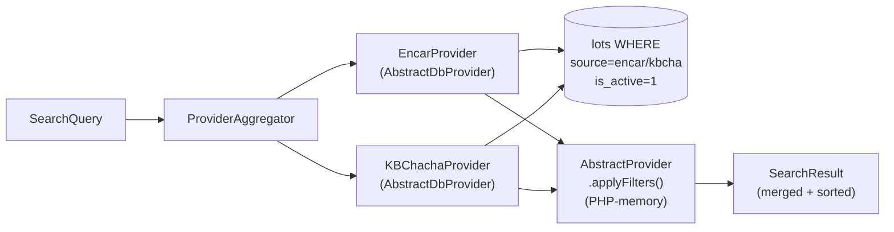
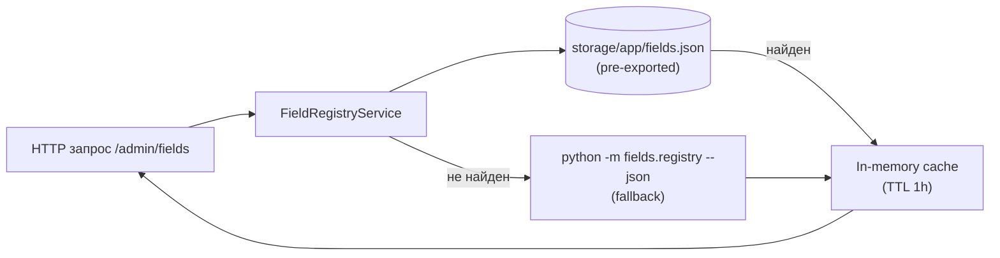

# 08 · API & Admin Panel

> [← Taxonomy](./07-taxonomy.md) · [Index](./index.md) · [Bot →](./09-bot.md)

---

## REST API (`/api/`)

### Публичные endpoints

| Метод | Путь | Описание |
|-------|------|----------|
| `GET` | `/api/filters` | Марки, модели, источники, значения полей |
| `GET` | `/api/filters/context` | Динамический контекст фильтров для текущей выборки |
| `GET` | `/api/filters/trims` | Автодополнение трима |
| `GET` | `/api/lots/{id}/inspection` | Детали инспекции лота |

### Защищённые endpoints (Telegram auth)

Middleware `ValidateTelegramAuth` проверяет HMAC-подпись `initData` от Telegram WebApp.

| Метод | Путь | Описание |
|-------|------|----------|
| `POST` | `/api/search` | Поиск лотов с фильтрами |
| `GET` | `/api/favorites` | Список избранных лотов |
| `POST` | `/api/favorites` | Добавить лот в избранное |
| `DELETE` | `/api/favorites/{id}` | Удалить из избранного |
| `GET` | `/api/subscriptions` | Активные подписки мониторинга |
| `POST` | `/api/subscriptions` | Создать подписку |
| `DELETE` | `/api/subscriptions/{id}` | Удалить подписку |
| `POST` | `/api/subscriptions/{id}/seen` | Пометить новые лоты как просмотренные |

---

## Провайдерный слой



`AbstractDbProvider` строит SQL-запрос с основными фильтрами (make, model, year, price, mileage).  
`AbstractProvider.applyFilters()` — финальная PHP-фильтрация в памяти для сложных условий (bool-комбинации, tolerance-диапазоны, массивы значений).

---

## Админ-панель (`/admin/`)

Защищена middleware `admin.auth` (сессия `AdminUser`).

| Страница | Контроллер | Назначение |
|----------|-----------|------------|
| `/admin/lots` | `AdminLotsController` | Просмотр и поиск по таблице `lots` |
| `/admin/taxonomy/rules` | `TaxonomyRulesController` | Управление `taxonomy_rules` |
| `/admin/bot-filters` | `BotFiltersController` | Настройка полей бот-поиска |
| `/admin/filters` | `ParseFiltersController` | PRE/POST правила фильтрации |
| `/admin/filter-skip-log` | — | Лог отфильтрованных лотов |
| `/admin/parser/jobs` | `ParserJobsController` | История запусков парсера |
| `/admin/fields` | `FieldsController` | Браузер реестра полей |
| `/admin/logs` | `LogsController` | Просмотр логов приложения |

---

## FieldMappingsService / FieldRegistryService

Эти сервисы предоставляют PHP-слою метаданные из Python-парсера.



Экспорт обновляется командой `php artisan export:fields-schema` и коммитится в репо — Railway-деплои не требуют Python в runtime.

---

## Мини-приложение (`/miniapp/`)

Статическая Telegram Mini App (Vanilla JS).

```
GET /miniapp/         → index.html
JS модули:
  telegram.js    Инициализация Telegram.WebApp SDK
  api.js         Fetch-обёртки для /api/*
  filters.js     Логика панели фильтров
  results.js     Рендер карточек лотов
  app.js         Точка входа, координация
```

Авторизация: Mini App передаёт `initData` в заголовке `X-Telegram-Init-Data`, middleware проверяет HMAC.

---

[← Taxonomy](./07-taxonomy.md) · [Index](./index.md) · [Bot →](./09-bot.md)
