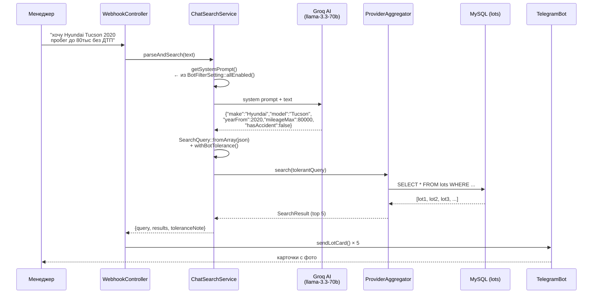

# 09 · Telegram Bot

> [← API](./08-api.md) · [Index](./index.md) · [Filters →](./10-filters.md)

---

## Поиск по свободному тексту

Основной сценарий бота: менеджер пишет запрос в чат, бот находит машины.



---

## `ChatSearchService`

| Метод | Описание |
|-------|----------|
| `parseAndSearch(text)` | Полный цикл: текст → JSON → SearchQuery → результаты |
| `getSystemPrompt()` | Генерирует промпт из активных `BotFilterSetting` (кэш Redis 60с) |
| `parseQuery(text)` | Только AI-вызов, возвращает сырой JSON |
| `fallbackParse(text)` | Regex-парсинг на случай недоступности AI |
| `buildToleranceNote()` | Описание применённых погрешностей для ответного сообщения |

---

## Динамический AI-промпт

Промпт собирается из `BotFilterSetting::allEnabled()` — включённых полей из таблицы `bot_filter_settings`.

```
Пример сгенерированного блока фильтров:

- make (string) — Производитель
- model (string) — Модель
- yearFrom, yearTo (int) — Год выпуска
- priceMin, priceMax (int) — Цена (KRW)
- mileageMin, mileageMax (int) — Пробег (км)
- fuelTypes (string[]) — Тип топлива. Допустимые: "gasoline", "diesel", "hybrid", "electric"
- hasAccident (bool) — История ДТП
- ownersCountMax (int) — Максимум владельцев
- insuranceCountMax (int) — Максимум страховых случаев
```

Кэш инвалидируется при сохранении настроек через `BotFilterSetting::flushCache()`.

---

## `BotFilterSetting` — настройки полей

Управляются через `/admin/bot-filters`.

| Колонка | Описание |
|---------|----------|
| `field_name` | Имя поля из `fields.json` |
| `field_label` | Человекочитаемое название (рус.) |
| `dtype` | `int` \| `float` \| `enum` \| `bool` \| `string` |
| `enabled` | Включить в AI-промпт и поиск |
| `tolerance_type` | `none` \| `absolute` \| `percentage` |
| `tolerance_value` | Значение погрешности (абсолютное или дробное) |
| `display_in_card` | Показывать поле в карточке бота |
| `enum_values` | JSON-массив допустимых значений (для подсказки в промпте) |

### Дефолтные погрешности

| Поле | Тип | Значение |
|------|-----|----------|
| `price` | percentage | ±15% |
| `mileage` | absolute | ±10 000 км |
| `year` | absolute | ±1 год |
| `engine_volume` | percentage | ±10% |
| `insurance_count` | absolute | ±1 |
| `owners_count` | absolute | ±1 |

---

## Карточка лота

Состав карточки определяется полями с `display_in_card = true`.

```
🚗 BMW 5 Series 2021 · Encar
💰 ₩35,000,000 · 🛣 48,000 km
⛽ Diesel · ⚙️ Automatic · 3.0L · AWD
📋 0 страховых · ✅ Без ДТП · 👤 1 владелец
📍 Seoul, Korea
🔗 Открыть лот
```

---

## Подписки (мониторинг)

Подписки работают через `CheckSubscriptions` Artisan-команду, запускаемую по расписанию:

1. Читает активные `subscriptions` с сохранёнными `SearchQuery`-параметрами
2. Запускает поиск по каждой подписке
3. Сравнивает с `seen_lot_ids` — находит новые лоты
4. Отправляет карточки в Telegram (до N новых лотов)
5. Обновляет `subscriptions.new_lots_count`

---

[← API](./08-api.md) · [Index](./index.md) · [Filters →](./10-filters.md)
