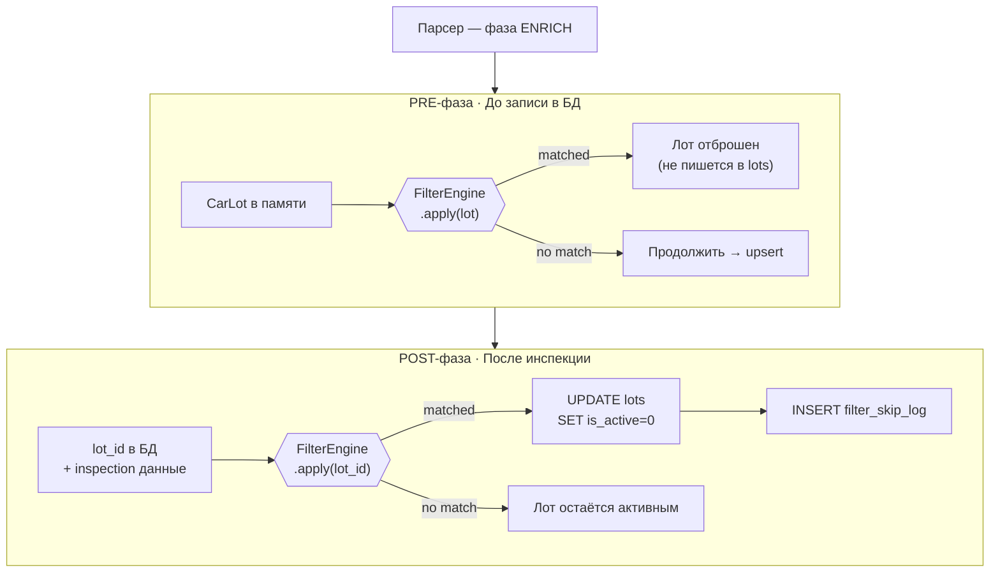

# 10 · Filter Engine

> [← Bot](./09-bot.md) · [Index](./index.md) · [Commands →](./11-commands.md)

---

## Назначение

FilterEngine (Python) определяет, **какие лоты вообще попадают в БД** и остаются активными.  
Это отдельно от поиска пользователей — это политики исключения источника данных.

---

## Две фазы



### Зачем два этапа?

| Фаза | Когда | Что доступно |
|------|-------|-------------|
| **PRE** | До DB-вставки | Базовые поля из листинга: make, model, year, price, mileage, fuel, body_type |
| **POST** | После инспекции | drive_type (из инспекции), детали ДТП, страховые случаи, специфические флаги |

---

## Структура правила (`parse_filters`)

| Колонка | Описание |
|---------|----------|
| `phase` | `pre` \| `post` |
| `source` | Источник (`encar`, `kbcha`) или `*` = все |
| `rule_group` | Логическая группа (правила внутри группы объединяются OR; группы — AND) |
| `field` | Поле лота для сравнения |
| `operator` | Оператор сравнения (см. ниже) |
| `value` | Значение для сравнения |
| `is_active` | Включить/отключить без удаления |
| `notes` | Комментарий |

### Операторы

| Оператор | Пример |
|----------|--------|
| `eq` | `sell_type = auction` |
| `ne` | `fuel != electric` |
| `gt` / `gte` | `year >= 2018` |
| `lt` / `lte` | `price <= 50000000` |
| `in` | `make IN [현대, 기아, 제네시스]` |
| `not_in` | `body_type NOT IN [truck, van]` |
| `contains` | `model CONTAINS "SUV"` |
| `regex` | `plate_number MATCHES "^[가-힣]{2}\d{4}"` |

---

## Логика групп

```
rule_group = "A": sell_type = "auction"
rule_group = "A": source = "kbcha"
rule_group = "B": year < 2015

Результат: (sell_type="auction" OR source="kbcha") AND (year < 2015)
```

Это позволяет строить сложные условия без кода.

---

## `filter_skip_log`

Каждый отфильтрованный лот логируется:

```sql
lot_id
source
make, model, year
filter_id       -- какое правило сработало
reason          -- человекочитаемое объяснение
created_at
```

Просмотр через `/admin/filter-skip-log`.

---

## Управление

Правила управляются через `/admin/filters`.  
Filter Engine в парсере перезагружает правила из БД **каждые 60 секунд** — изменения применяются без перезапуска парсера.

---

[← Bot](./09-bot.md) · [Index](./index.md) · [Commands →](./11-commands.md)
